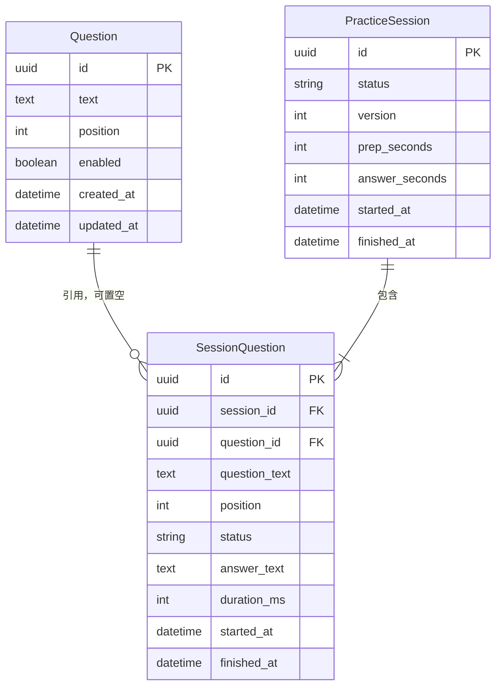
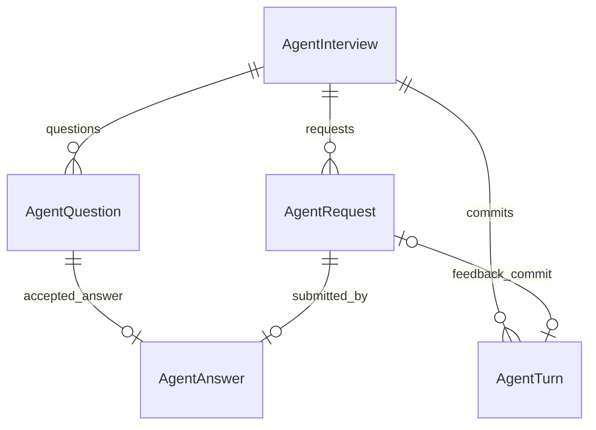
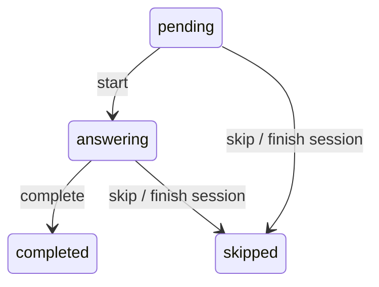

# 数据库 Schema

SQLite 存储，Django migrations 管理结构。所有时间为 UTC，API 返回 ISO 8601。
练习表及 Agent 面试/请求/回答使用 UUID；AgentQuestion 沿用 Agent 字符串 ID，AgentTurn 使用数据库自增主键。

上述三张表只负责固定题库练习。Agent 面试使用下文五张独立表；流式诊断仍不创建数据库记录。

## Agent 面试：关系约束与契约快照

| 表 | 主要字段 | 约束及用途 |
| --- | --- | --- |
| AgentInterview | id、status、job_title、context、state_version、latest_action、时间 | 最新上下文唯一来源；未初始化时 context 为空且版本为 0；终态必须有 closed_at |
| AgentRequest | UUID、interview_id、kind、status、response、error_code、时间 | 请求 UUID 全库唯一；一场面试最多一条 running 请求；成功响应必须与结束时间同时存在 |
| AgentQuestion | Agent 问题 ID、interview_id、ordinal、payload | 问题 ID 全局唯一；同场题号唯一；题目内容不可被其他场次覆盖 |
| AgentAnswer | UUID、question_id、request_id、text、evaluation、committed_state_version | 一题一答、一请求一回答；评价与提交版本同时存在，区分已接收与已评分 |
| AgentTurn | id、interview_id、state_version、feedback_request_id、action、decision_log | 同场版本唯一；每个反馈请求最多提交一次；初始化/阶段转换可无反馈请求 |

关系字段承担查询和约束；context、问题、动作和评价 JSON 保持共享契约原值，避免复制评分规则。
当前上下文不再在每个业务表重复存放。请求响应刻意保留发送时快照，以便网络交付失败后查询已完成结果；
它是不可变交付记录，不是另一份可写状态。尚未引入向量库、PostgreSQL 迁移或新的账户模型。

写入先执行带 `state_version` 条件的 UPDATE，再在同一短事务发布上下文、题目、评价和决策。
这避免依赖 SQLite 行锁，也防止两个旧版本都提交成功；任何后续约束失败撤销整轮写入。
事务内不调用 LLM。后端仓库不重试数据库失败；Agent 原有版本冲突处理规则保持不变。
回答在评价前写入，但直到单轮提交成功，评价与版本标记才同时可见。

历史列表索引为 `(created_at DESC, id DESC)`，请求历史使用 `(interview_id, created_at, id)`；
问题和提交的复合唯一约束同时支持按场次、题号或版本读取。列表不加载大 JSON，详情才读取正文。
这些复合索引的首列已覆盖 interview_id，因此对应外键不再额外创建重复单列索引；外键约束仍保留。
现有三张练习表、计时、评分、模型与重试参数均保持原样。

`preparing/active` 表示服务仍可执行，`completed/interrupted/failed` 为当前连接生命周期终态。
Agent 内部 finished 不自动等于报告已生成；只有保存完整 finished 响应后才标记 completed。
正常退出会记录中断；进程骤停可能留下 running 请求，应人工核查，当前无自动恢复和重放机制。
迁移 `0004_agent_persistence` 仅新增表与约束，不重写既有练习数据。
`0005_agent_request_order` 将请求索引补齐 UUID 排序列，消除相同时间下分页排序所需的临时 B-tree。

## Question · 题库

- text：必填、非空，最多 4000 字符。
- position：非负整数，默认 0；按 position、created_at、id 稳定排序。
- enabled：默认 true，停用后不可用于创建新场次。
- API 提供新增、查询、修改；不提供删除，通常通过停用保留题库。

## PracticeSession · 一轮练习

- status：active → completed，不允许重新开启。
- prep_seconds=10、answer_seconds=90：只读，创建接口不接受覆盖。
- version：初值 1，每次单题变更或结束场次时递增。
- finished_at：active 时为空，completed 时非空，由数据库约束保证。
- 创建时取启用题目，或按 question_ids 顺序选择，数量 1–100；空题库、重复 ID、失效 ID 均拒绝。

一场次对应一遍所选题目，需要循环练习时明确创建下一场次。这里的练习记录尚未实现根目录 Agent 的 RepositoryPort，不应与其状态模型直接混用。

## SessionQuestion · 单题快照和作答记录

- session_id：场次外键，删除时级联（当前无删除场次 API）。
- question_id：可空外键，源题目被数据库操作删除时置空。
- question_text：创建时快照，不跟随题库编辑，最多 4000 字符。
- position：从 1 开始，(session_id, position) 唯一。
- answer_text：可选，最多 20000 字符。
- duration_ms：可选非负整数，由客户端报告；空表示未提供，不解释为 0。
- started_at、finished_at：服务端记录动作时间，不推算客户端暂停时长。

同场次最多一题 answering，由业务检查与 SQLite 条件唯一约束保证。completed / skipped 为终态。
结束场次时，其余 pending / answering 题目记 skipped。本 API 不执行后台倒计时，不伪造真实作答时长。

## 并发与事务

变更请求携带最近读取的 version。事务首先执行条件 UPDATE，id + version + status=active 匹配才递增版本。
版本冲突返回 409；非法动作或跨场次题目 ID 会回滚版本与数据。结束场次和批量跳过同属一个事务。
不依赖 SQLite 不支持的行级 SELECT FOR UPDATE；数据库不可用返回 503 并记录日志，不自动重试。

## 流式测试 · 仅内存

connection_id、模式、字节数、分片数、校验统计只存在于连接内存与页面显示中，连接结束后不保留服务端历史。
迁移 0003 删除旧诊断表及其中测试统计；迁移历史保留以支持已有数据库升级，不删除题库、场次和作答记录。

## MySQL 说明

本次未实现或测试 MySQL。未来切换需增加驱动和显式配置，并重验迁移、并发、约束；尤其 one_answering_item 条件唯一约束不能直接当作 MySQL 上的相同保障。
