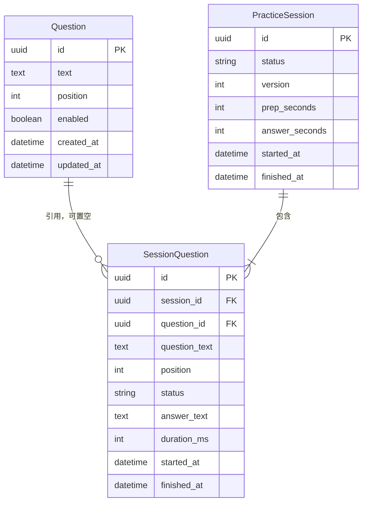
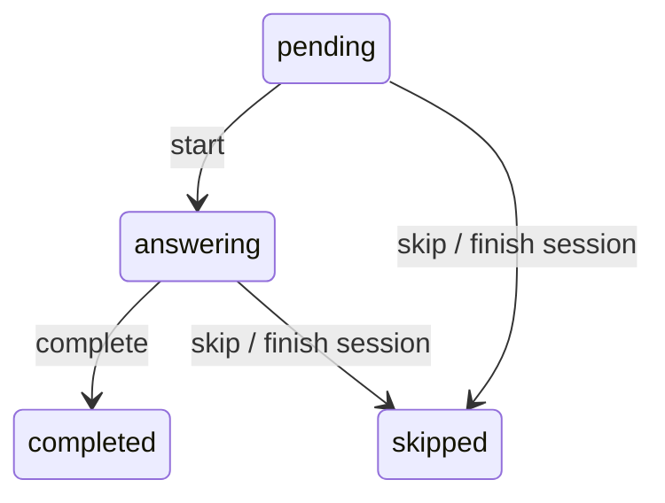

# 数据库 Schema

SQLite 存储，Django migrations 管理结构。所有时间为 UTC，API 返回 ISO 8601，主键均为 UUID。

数据库只包含上述三张业务表；流式测试不创建数据库记录。

## Question · 题库

- text：必填、非空，最多 4000 字符。
- position：非负整数，默认 0；按 position、created_at、id 稳定排序。
- enabled：默认 true，停用后不可用于创建新场次。
- API 提供新增、查询、修改；不提供删除，通常通过停用保留题库。

## PracticeSession · 一轮练习

- status：active → completed，不允许重新开启。
- prep_seconds=10、answer_seconds=90：只读，创建接口不接受覆盖。
- version：初值 1，每次单题变更或结束场次时递增。
- finished_at：active 时为空，completed 时非空，由数据库约束保证。
- 创建时取启用题目，或按 question_ids 顺序选择，数量 1–100；空题库、重复 ID、失效 ID 均拒绝。

一场次对应一遍所选题目，需要循环练习时明确创建下一场次。这里的练习记录尚未实现根目录 Agent 的 RepositoryPort，不应与其状态模型直接混用。

## SessionQuestion · 单题快照和作答记录

- session_id：场次外键，删除时级联（当前无删除场次 API）。
- question_id：可空外键，源题目被数据库操作删除时置空。
- question_text：创建时快照，不跟随题库编辑，最多 4000 字符。
- position：从 1 开始，(session_id, position) 唯一。
- answer_text：可选，最多 20000 字符。
- duration_ms：可选非负整数，由客户端报告；空表示未提供，不解释为 0。
- started_at、finished_at：服务端记录动作时间，不推算客户端暂停时长。

同场次最多一题 answering，由业务检查与 SQLite 条件唯一约束保证。completed / skipped 为终态。
结束场次时，其余 pending / answering 题目记 skipped。本 API 不执行后台倒计时，不伪造真实作答时长。

## 并发与事务

变更请求携带最近读取的 version。事务首先执行条件 UPDATE，id + version + status=active 匹配才递增版本。
版本冲突返回 409；非法动作或跨场次题目 ID 会回滚版本与数据。结束场次和批量跳过同属一个事务。
不依赖 SQLite 不支持的行级 SELECT FOR UPDATE；数据库不可用返回 503 并记录日志，不自动重试。

## 流式测试 · 仅内存

connection_id、模式、字节数、分片数、校验统计只存在于连接内存与页面显示中，连接结束后不保留服务端历史。
迁移 0003 删除旧诊断表及其中测试统计；迁移历史保留以支持已有数据库升级，不删除题库、场次和作答记录。

## MySQL 说明

本次未实现或测试 MySQL。未来切换需增加驱动和显式配置，并重验迁移、并发、约束；尤其 one_answering_item 条件唯一约束不能直接当作 MySQL 上的相同保障。
