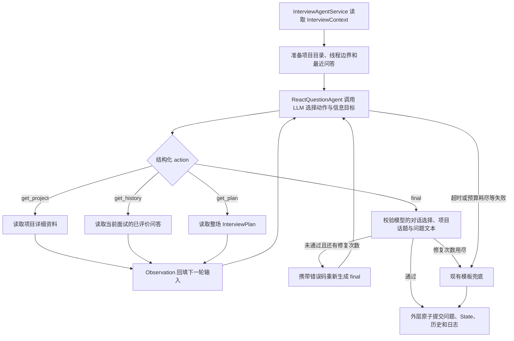

# Question Agent：ReAct 架构实现与运行指南

本文对应当前仓库实现，说明出题循环、数据流、Windows PowerShell 启动命令，以及执行轨迹的查看方式。

## 1. 当前实现范围

Question Agent 已默认启用有边界的 ReAct 循环：模型决定是否补充信息，程序执行只读工具，将结果交给下一轮模型调用，最后输出一个问题。

当前默认由 Question Agent 选择追问/换话题/换项目和信息目标；外层程序校验边界并提交状态，不预先指定本题的对话动作。多维能力证据仅用于回答评价和报告，confidence 已移除。具体实现见 [对话驱动出题改造方案](对话驱动出题改造方案.md)。

本次没有新增 RAG 或 `search_resume`。新增 `get_project` 只读现有结构化简历。初始输入不注入完整项目资料或预定题目计划；旧 ContextBuilder 和可选 RAG 路径仅用于非自主模式。

## 2. 整体执行流程



这里的“思考”体现为模型对下一步 action 的选择；代码没有解析或保存自由文本的 Thought。也不要求每题都调用工具：已有信息足够时可以直接 `final`。

## 3. 核心文件

| 文件 | 职责 |
| --- | --- |
| [agents/question/react.py](../agents/question/react.py) | action schema、循环、工具分发、Observation、预算、修复和执行结果 |
| [agents/prompts/question_react_v1.md](../agents/prompts/question_react_v1.md) | 模型指令、工具说明及输出约束 |
| [agents/orchestrator/service.py](../agents/orchestrator/service.py) | 外层策略、调用 ReAct、传入回答、提交历史及兜底 |
| [agents/domain/models.py](../agents/domain/models.py) | 问答历史、InterviewContext 和决策日志模型 |
| [agents/config/defaults.yaml](../agents/config/defaults.yaml) | 默认配置 |
| [agents/config/loader.py](../agents/config/loader.py) | 配置类型及取值校验 |
| [app/application.py](../app/application.py) | 终端流程，将 CandidateAnswer 传给 Agent |
| [backend/interviews/agent_session.py](../backend/interviews/agent_session.py) | 网页面试流程，将 CandidateAnswer 传给 Agent |
| [tests/agent/integration/test_question_react.py](../tests/agent/integration/test_question_react.py) | 循环、超时、恢复、并发隔离和数据边界测试 |

实现复用 `LLMPort.generate_structured()`，不需要新增 LangChain、LangGraph 或供应商原生工具调用接口。LLM 返回结构化 action，由本地 Python 分发执行。

## 4. 模型输入与可用动作

每轮输入包括：

- `dialogue_state`：项目与可选话题目录、当前线程、剩余追问数及不可追问原因；不含预定选择。
- 完整项目资料通过 `get_project` 按需读取。
- `state_summary`：面试阶段、剩余逻辑时间、题目序号、连续追问数；不含能力状态。
- `latest_turn`：最近一个已评价问题、原始回答及反馈；首题为 null。
- `observations`：本轮已执行工具的参数和结果。
- `tools_remaining`、`final_only`：剩余工具预算及是否只能生成最终问题。
- `repair_errors`：输出不合格时的错误码。

`QuestionAgentDecision` 使用以下字段，禁止额外字段；工具动作的 selection 为 null：

```json
{
  "action": "get_history",
  "topic": null,
  "limit": 3,
  "text": null,
  "project_id": null,
  "selection": null
}
```

| action | 参数与行为 |
| --- | --- |
| `get_project` | `project_id` 指定当前面试中的项目；读取项目描述、技术、主张及指标，其余参数为 null |
| `get_history` | `topic` 可为 null，或按问题话题做大小写不敏感的子串过滤；`limit` 指定最近若干条；返回配对的 question、answer、analysis |
| `get_plan` | `topic`、`limit`、`text` 均为 null；读取整场面试计划 |
| `final` | `text` 为最终问题；selection 包含 dialogue_action、project_id、topic_key、information_goal、decision_summary；顶层 topic/limit/project_id 为 null |

注意：`InterviewPlan` 是整场面试计划，`PlannedQuestion` 是当前这道题的计划。后者在模型返回有效选择后构建；`get_plan` 仅在需要整场计划细节时调用。

工具读取当前调用拿到的上下文快照，不能修改 State，也没有指定其他面试 ID 的参数。执行期间的 Observation 保存在本轮局部变量中，不保存在共享 Agent 实例上。

## 5. 问答历史如何进入下一题

应用在评价结束后调用：

```python
await service.apply_evaluation_feedback(
    interview_id,
    feedback,
    elapsed_seconds=120,
    answer=candidate_answer,
)
```

Agent 将问题快照、回答和反馈组成 `InterviewHistoryEntry`，追加到 `InterviewContext.question_history`，供本轮下一题读取。只有最终动作成功提交，历史才一起落库；阶段切换和结束动作也会提交这份历史。

重复反馈沿用原有幂等处理；状态冲突后从仓库重新计算，不会把同一轮历史重复追加到已提交状态。老版本上下文缺少该字段时按空列表读取；旧调用方没有传 `answer` 时，历史中的回答为 null，不会自动补回旧回答。

持久化能力取决于入口：

- **网页后端**：使用 Django/SQLite 保存上下文，重建 Repository 后仍能读取历史。当前网页协议仍不支持断线后继续原面试。
- **终端 CLI**：使用内存仓库，进程退出后历史不保留。

后端上下文原本就是 JSON 存储，此字段不需要新增数据库迁移；首次启动项目仍需执行已有迁移。

## 6. 默认限制、校验和兜底

项目与话题的总题数在 `agent.max_questions_per_project`（默认 4）和 `agent.max_questions_per_topic`（默认 3）配置，主问题与追问均计数。话题用完可换同项目的其他话题；项目用完必须换项目，没有可问项目则提前结束。计数从持久化线程累计，换话题、历史裁剪、重启不会重置。旧 `--max-follow-up-per-topic N` 参数仅作为入口兼容，转换成话题总题数 N+1，不能和新话题参数同时使用。

配置位于 `agents/config/defaults.yaml` 的 `agent.question_agent`：

```yaml
question_agent:
  enabled: true
  max_tool_calls: 2
  total_timeout_seconds: 90.0
  history_retention: 50
  history_tool_limit: 10
  text_char_limit: 4000
```

| 配置 | 含义 |
| --- | --- |
| `enabled` | false 时切回原单次生成器 |
| `max_tool_calls` | 每题最多两次工具尝试，重复调用也消耗预算 |
| `total_timeout_seconds` | 整个 ReAct 循环的总截止时间，包含修复 |
| `history_retention` | 上下文最多保留 50 个已评价问答条目 |
| `history_tool_limit` | 每次工具返回最多 10 条历史 |
| `text_char_limit` | 历史输入中的单个问题或回答正文最多 4000 字符，工具结果标记截断；不是数据库原始回答的长度限制 |

单次模型调用使用 `timeouts.llm_generation_seconds: 30.0` 和 `retries.llm_generation_retries: 1`。因此默认每题最多四次模型决策调用：两次工具选择、一次 final、一次修复；也可能第一次就直接结束。

相同工具参数重复出现时返回错误 Observation，不重复执行。工具预算耗尽后必须 final。final 校验失败后，只允许修复 final，不再补调工具。

自主模式由模型提交对话动作、项目、话题、信息目标和问题文本，程序校验后构造题目计划。校验包含长度、问号数量、评分信息泄露、内部 UUID 泄露等规则，以及与可用历史文本的标准化精确重复检查。它不能证明语义没有重复，也不能保证所有表述都有事实依据，仍需真实样例评估。

英文问题长度上限为 110 词，允许“背景说明 + 一个重点问题”。切换项目或候选人询问项目指代时，问题应说明项目名称与相关工作。兜底也保留项目名称，不再因为名称超过 80 字符而退化成 this project。结构失败会记录字段路径和错误代码，并传入修复轮次；不再只有泛化的 INVALID_DECISION:LLMError。

超时、修复次数用尽或模型违反预算等情况走现有模板兜底。取消异常向上传播，不提交该轮新问题。底层 HTTP 请求使用该次调用的剩余预算，SDK 自动重试关闭；出题 JSON 修复由 ReAct 循环统一计数。同步供应商线程可能在异步超时后继续完成已发出的请求，但迟到结果不会被采用，也不会向下一题写入迟到错误。

日志会记录错误所属题号、阶段、调用轮次、调用 ID、耗时、超时范围（单次调用或整轮 ReAct）、错误分类和可用的 HTTP 状态码，不记录可能带请求正文或密钥的原始异常文本。整轮 90 秒是上限，并非保证完成四次 30 秒调用。放宽预算不能保证供应商可用，真实请求失败时仍会明确记录兜底。

## 7. Windows PowerShell 运行完整网页项目

当前可运行的网页位于 `backend/frontend/`，由后端直接提供；不需要另开 npm 前端服务。根目录 `frontend/` 是产品前端预留目录。

### 7.1 安装依赖

```powershell
Set-Location D:\Interview\AiInterviewer

# 当前项目已有 .venv 时跳过创建；没有时使用本机 Python 3.11+ 创建。
if (-not (Test-Path .\.venv\Scripts\python.exe)) {
    python -m venv .venv
}

.\.venv\Scripts\python.exe -m pip install -r .\backend\requirements.txt
```

以下命令直接使用虚拟环境解释器，不需要 Activate.ps1。

### 7.2 配置网页端模型

```powershell
Set-Location D:\Interview\AiInterviewer
if (-not (Test-Path .\backend\.env)) {
    Copy-Item .\backend\.env.example .\backend\.env
}
notepad .\backend\.env
```

编辑 `backend/.env`，例如使用项目已有的千问配置：

```dotenv
LLM_PROVIDER=dashscope
DASHSCOPE_API_KEY=填写你的密钥
DASHSCOPE_MODEL=qwen-plus
DASHSCOPE_BASE_URL=https://dashscope.aliyuncs.com/compatible-mode/v1
OPENAI_TEMPERATURE=0
```

模型名和区域地址应对应你的供应商账户。网页后端只自动读取 `backend/.env`；终端读取仓库根目录 `.env`。进程环境变量优先于文件，修改配置后重启服务。

### 7.3 初始化数据库并启动

在同一个 PowerShell 窗口执行：

```powershell
Set-Location D:\Interview\AiInterviewer\backend
$env:DJANGO_SECRET_KEY = & ..\.venv\Scripts\python.exe -c "import secrets; print(secrets.token_urlsafe(48))"
..\.venv\Scripts\python.exe manage.py migrate
..\.venv\Scripts\python.exe -m uvicorn config.asgi:application --host 127.0.0.1 --port 8765 --ws websockets-sansio
```

打开 **http://127.0.0.1:8765/agent/**，粘贴简历文本，设置题数和岗位，然后开始面试。此入口会使用默认启用的 ReAct 出题流程。

`DJANGO_SECRET_KEY` 是 Django 应用密钥，与模型 API key 不同。上面的随机值只对当前 shell 有效；也可自行生成后保存在 `backend/.env` 中供后续启动使用。

面试使用 WebSocket，需使用上述 ASGI 启动命令，不能用 `manage.py runserver` 替代。结束服务按 Ctrl+C。

先粘贴文本即可跑通解析、出题、回答评价、报告和数据库保存。网页上传 PDF 还需独立的 WSL PDF 沙箱与视觉模型配置，详见 [PDF 指南](../backend/docs/resume-pdf.md) 和 [沙箱说明](../backend/sandbox/README.md)；只启动上述服务并不代表 PDF 上传功能已配置完成。

### 7.4 仅运行终端面试

先编辑 `D:\Interview\AiInterviewer\.env`，填写模型配置，然后运行：

```powershell
Set-Location D:\Interview\AiInterviewer
.\.venv\Scripts\python.exe main.py .\Wang_Shunyao_CV.pdf --max-questions 8 --max-questions-per-project 4 --max-questions-per-topic 2 --job-title "AI Engineer"
```

可将简历路径替换为 UTF-8 TXT 或文本型 PDF。终端入口不需要 Django 服务，也不使用后端数据库。

## 8. ReAct 的“思考过程”能显示吗？

**当前能查看完整可观察执行记录，但不记录模型内部未返回的推理文本，也没有实时工具步骤面板。**

终端 `main.py` 默认静默保存到项目 `output/interview_时间戳_唯一编号.md`，
**每次面试只有一个 Markdown 文件**，不再创建子目录和额外 JSON 文件。运行命令不变，
面试过程中不显示调试内容，结束或中断后提示文件路径。

按顺序保留的关键节点：

- 岗位、题数、简历解析完成。
- 每次出题的项目、话题及各自已问题数/上限，对话动作、信息目标、关联上一题和追问判断。
- 工具名称及结果摘要，例如 get_history 返回几条历史。
- ReAct 动作路径、结束原因、总耗时，以及定位到题目和调用轮次的错误信息。
- 实际提交的最终问题、生成方式（模型或兜底）。
- 候选人回答、多维证据、相关度和证据强度（已移除置信度）。
- 最终总分、报告摘要及完成/取消/失败状态；无评分证据时显示“证据不足，暂不评分”。

不再写入完整 Prompt、模型输入输出 JSON、State 快照、工具返回正文和完整报告 JSON。
长问题或回答最多保留 1200 字符，报告摘要最多 1500 字符，超出部分明确标记截断。
关键节点即时刷新，取消时保留已有内容；强制杀死进程时可能缺少结束状态。
旧版已生成的多文件目录不会自动删除。

`--output-dir` 仍可指定输出根目录。记录包含面试资料，`output/` 已被 Git 忽略。
此功能仅默认接入终端 main.py；网页仍使用原有数据库日志。
直接调用 run_interview 的脚本可以用 `FileTrace` 上下文及 `trace.save_result(result)`
保存同样的单文件记录。

当前 prompt 明确要求返回 action 和参数，不输出 reasoning transcript。现有数据足以展示“读取历史 → 查看计划 → 生成问题”这样的可验证执行步骤，但不能据此还原模型内部思考。

日志字段如下：

- `question_agent_steps`：动作、状态；工具动作还记录结果条数。
- `question_agent_stop_reason`：结束原因，如 `FINAL`、`TIMEOUT`、`TOOL_LIMIT`、`INVALID_OUTPUT`、`STEP_LIMIT` 或 `ERROR:异常类型`。
- `NOT_RUN`：本轮没有运行 ReAct，例如被前置策略直接送入兜底、没有 LLM，或关闭了 ReAct。

示例仅用于说明结构，不表示每题都会执行这些步骤：

```json
{
  "question_agent_steps": [
    {"action": "get_history", "status": "OK", "result_count": 2},
    {"action": "get_plan", "status": "OK", "result_count": 0},
    {"action": "final", "status": "VALID"}
  ],
  "question_agent_stop_reason": "FINAL"
}
```

`get_plan` 的 `result_count=0` 只是因为这个计数字段统计历史 entries 数量，不代表没有返回计划。
原有 `decision_logs` 和终端的单文件记录都只保存关键摘要，不包含完整 Observation
或模型未返回的内部推理文本。

### 8.1 网页面试结束后查看

当前网页的报告 JSON 展示完整 `message.result`，其中包含 `decision_logs`。搜索 `question_agent_steps` 即可找到每轮的执行轨迹。

也可以在浏览器开发者工具 Network → WebSocket `/ws/agent/` 的消息里，查看最后一个 `finished` 消息中的：

```text
result.decision_logs[].question_agent_steps
result.decision_logs[].question_agent_stop_reason
```

### 8.2 出题完成后立即查询最近动作

服务运行期间，在另一个 PowerShell 窗口中读取历史 API：

```powershell
$baseUrl = 'http://127.0.0.1:8765'
$listing = Invoke-RestMethod "$baseUrl/api/agent-interviews/"
$listing.results | Select-Object id, status, job_title, created_at

# 替换为上面列表中当前面试的 id。
$interviewId = '替换为面试ID'
$detail = Invoke-RestMethod "$baseUrl/api/agent-interviews/$interviewId/"
$detail.latest_action.decision_trace.details.question_agent_steps | ConvertTo-Json -Depth 10
$detail.latest_action.decision_trace.details.question_agent_stop_reason
```

这个方式读取**已提交的最近动作**，不显示尚在生成中的中间步骤。最好在问题出现后、回答前查询；面试结束后最近动作是 FINISH，应改用完整报告中的决策日志。

### 8.3 终端查看日志

当前 `main.py` 默认只打印问题和最终报告；关键节点自动保存为 output 下的单个 Markdown 文件。
原命令直接可用：

```powershell
Set-Location D:\Interview\AiInterviewer
.\.venv\Scripts\python.exe main.py .\Wang_Shunyao_CV.pdf --max-questions 5 --max-follow-up-per-topic 2 --job-title "AI Engineer"
```

如果自行编写 Python 脚本，也可以在结束后打印精简轨迹：

```python
from pathlib import Path

from app.application import build_application
from app.cli import run_interview
from app.parsing.files import read_resume

result = run_interview(
    build_application(),
    read_resume(Path("Wang_Shunyao_CV.pdf")),
    max_questions=3,
)
for log in result["decision_logs"]:
    print(log["question_agent_stop_reason"], log["question_agent_steps"])
```

### 8.4 如果要实时显示，需要增加什么？

这是后续 UI/事件接入工作，当前未实现。可在循环中加入事件回调，在工具开始、工具结束、校验失败和最终完成时推送 WebSocket 事件，前端显示时间线。

适合展示：工具名称、执行状态、命中条数、耗时、修复和兜底原因。如需解释“为什么查历史”，可以另加面向用户的简短决策摘要字段；它应明确标记为摘要，不能冒充模型完整内部推理。现有实现尚未生成这个摘要字段。

## 9. 离线测试命令

```powershell
Set-Location D:\Interview\AiInterviewer
.\.venv\Scripts\python.exe -m pip install "pytest>=8,<10" "pytest-asyncio>=0.24,<2" "ruff>=0.11,<1"
.\.venv\Scripts\python.exe -m pytest tests\agent\integration\test_question_react.py -q
.\.venv\Scripts\python.exe -m pytest -q

Set-Location .\backend
$env:DJANGO_SECRET_KEY = & ..\.venv\Scripts\python.exe -c "import secrets; print(secrets.token_urlsafe(48))"
..\.venv\Scripts\python.exe manage.py test interviews.tests.test_agent interviews.tests.test_agent_persistence interviews.tests.test_agent_progress --noinput
```

上次实现验证通过 98 项根目录测试、5 个子测试和 32 项相关后端测试；测试使用替身模型，没有进行真实供应商的出题质量评测。启动真实面试后会使用配置的模型服务。
