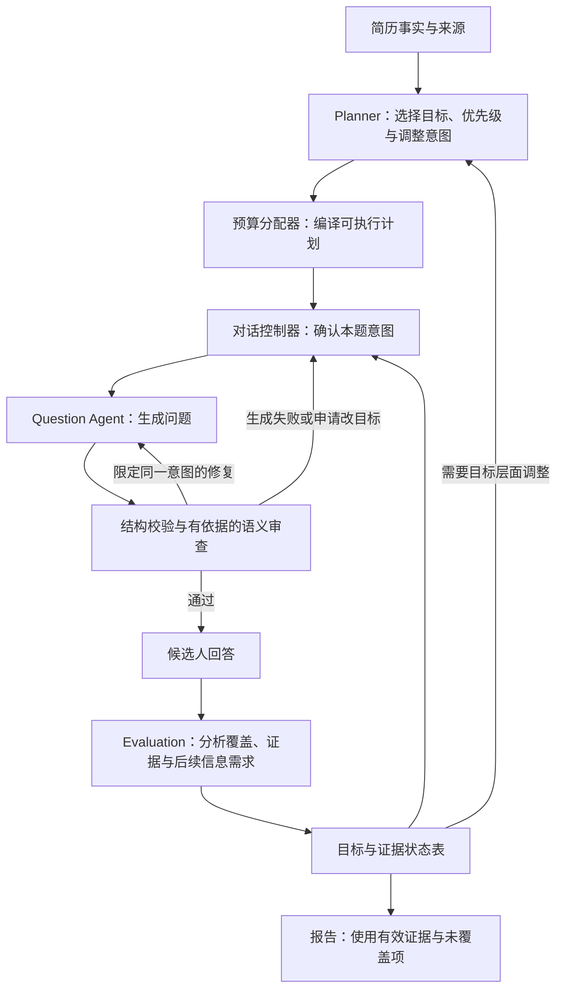

# 面试质量改造方案：保留目标、约束审查、可靠分配预算

状态：设计方案，尚未实施。日期：2026-09-29。

本方案针对两轮真实面试中观察到的追问误拦、修复后换题、话题完成状态失真、重规划超预算，以及评价不可用和最终报告归因问题。保留 Plan and Execute 与 ReAct，调整组件职责和状态契约。本阶段不处理 ReAct 主动工具调用，不修改模型、生产配置或业务代码。

## 1. 要解决的具体问题

| 实际现象 | 当前结构原因 | 需要改变的机制 |
|---|---|---|
| 问状态怎么存取、优先级怎么确定，被当作重复 | 审查主要比较问题与自由文本目标；重复结论不需要引用已回答证据 | 区分“问过”和“答清”，审查必须给出可核对依据 |
| 只问话题相关性，被要求加上难度和缺口；加上后又被判过载 | 复合话题没有明确的子目标关系；自由文本修复指令可以互相冲突 | 子目标合法性、回答单位和修复操作进入结构契约 |
| 追问被拒后直接换题通过 | ReAct 每轮都能重新提交 selection，跨修复轮没有锁住意图 | 修复只能修改当前意图下的问法；换题交还控制器 |
| 未补齐的目标被标 completed | DialogueController.record_question 把切走的 active 话题标为 completed/EXECUTOR_MOVED_ON | 分离执行状态与证据覆盖状态 |
| 五次后续规划只接受一次 | 模型负责重新输出整套秒数，超预算就整体拒绝 | 模型决定目标与优先级，程序计算可执行预算 |
| 一条引文有问题导致整题未评价；失败可能影响后续判断 | 对话分析与评分证据共用成功/失败结果，fallback 使用 partial 和 new_information=false | 独立标记系统评价不可用，不作为候选人表现 |
| 最终报告忽略纠正、引用未评价回答作能力结论 | 叙述模型重新读原始 Q&A，没有统一的有效证据和纠正关系 | 报告消费同一份有效证据状态 |

代码依据：`agents/question/react.py::_run`、`agents/question/quality.py::payload`、`agents/policies/dialogue_controller.py::record_question`、`agents/planning/planner.py::revise/_validate`、`app/adapters/evaluation.py`、`app/reporting/final_report.py`。

追问的语义判断仍然需要模型；增加结构并不能保证它永远判断正确。这里的目标是让错误判断可检查、可纠正，且不再自动扩大成丢失话题或虚构完成状态。

## 2. 改造后的职责



| 组件 | 可以决定 | 不可以决定 |
|---|---|---|
| Planner | 哪些目标重要、优先顺序、需深入/延后/移除的目标 | 具体面试问题；绕过全局时限与安全上限 |
| 预算分配器 | 目标的可执行时间、剩余预算、是否还有完整一问的空间 | 编造考察目标或候选人事实 |
| 对话控制器 | 继续、换题、暂停、恢复、结束；确认当前意图 | 把换题直接当成目标充分覆盖 |
| Question Agent | 当前意图下的具体问法与局部修复 | 在修复里自行更换项目、目标或线程 |
| 质量审查 | 指出问题文本的违规类型、依据和最小修改要求 | 调整预算、扩大考察范围、命令换题、要求补问整个父话题 |
| Evaluation | 提议证据覆盖更新、标出缺口、建议下一信息需求 | 自己提交路由或把系统失败当候选人不会 |
| 报告生成 | 基于已确认记录组织文字 | 对失效、已纠正或不可评价的回答重新自由归因 |

这些是逻辑职责，不要求新增多个模型 Agent。默认仍复用现有评价、规划、出题、审查调用。

## 3. 用目标与证据状态表代替自由文本之间的猜测

在现有 InterviewContext、TopicProgress、EvidenceRecord 上演进，不先建设独立数据库或复杂知识图谱。

每个考察目标保存：

- 稳定的 `objective_id`、所属项目/话题、可选父目标。
- `coverage_status`：unassessed、partial、sufficient；有争议的证据另存 conflict 状态，不能直接 sufficient。
- 该目标当前需要补充的具体信息及 `need_id`，例如“共享状态的存储与访问机制”。
- 支撑覆盖判断的 `answer_id`、原文位置和证据 ID。
- 已提问的范围、深度和回答结果，区分 asked 与 answered。
- `execution_status`：pending、active、deferred、closed，以及原因、重新进入的条件。

完成规则：只有目标要求的关键证据被接受，且没有影响结论的未决冲突，才可标 sufficient。一次回答可以覆盖多个目标；不设置每题必须追问或每话题固定深度层数。

执行退出不改变证据覆盖：

| 事件 | 执行状态 | 覆盖状态 |
|---|---|---|
| 回答已充分，继续下一目标 | closed | sufficient |
| 时间不够，暂缓高价值缺口 | deferred，记录原因 | 保持 partial/unassessed |
| 候选人明确不知道或拒答 | closed，记录候选人边界 | 保持实际覆盖，不标 sufficient |
| 系统评价失败 | 不自动关闭，不累计候选人无信息次数 | unassessed，或保留此前有效覆盖 |
| Question Agent 生成失败 | 控制器明确选择重试、延后或结束 | 不改变覆盖 |

`used_topic_keys` 不再同时表示“曾问过”“不能再问”“已完成”。恢复 deferred 目标时复用原目标身份并关联原线程/恢复事件；禁止借用新 ID 重置题数上限。重复反馈依旧通过现有幂等提交处理。

目标粒度按本次角色与时间选择，不能把所有项目都展开成必须答完的技术清单。评价提出的新缺口只有与当前目标有关、不是已回答内容、且值得占用剩余时间时才进入候选列表。

## 4. 在修复前冻结本题意图

引入 `TurnIntent`，至少包含：

```text
intent_id / revision
project_id / topic_key / objective_id / need_id
thread_id / dialogue_action
target：本题需要获得的一个主要信息结果
answer_unit：具体机制、选择依据、一个故障案例、一个综合决策规则等
allowed_scope：合法子目标及已有背景
source_question_id / source_answer_ids
```

短期落地无需额外一次模型请求：让现有首稿调用一起提出 selection 和问题文本，控制器校验其意图后冻结；下一次修复只能返回 `intent_id + revised_text`。即使首稿措辞不合格，它被确认的合法目标也不会被丢掉。

完成状态表接入后，现有 Evaluation 调用可同时给出少量有序的下一信息需求，控制器根据计划、缺口、候选人边界和时间确认本题意图；Question Agent 不再需要在每次修复时重新选择面试路线。系统启动时从初始计划选择目标。

必须保持以下不变量：

1. 去掉答案选项后，仍询问原来的存储机制。
2. 修改过载问题时，可删除同一主要请求之外的附带要求，但不能自行改变已确认的 need_id、target 或 answer_unit。确需改变这些字段时，由控制器批准新的 intent revision，并记录与旧意图的关系；“收窄”不能成为绕过冻结的入口。
3. 需要变更目标时返回 `REQUEST_RETARGET`；控制器记录原因并显式转换状态。不能把换题统计成原问题修复成功。
4. 已问且未答清的目标允许有意义的窄化；不能把“继续未回答部分”直接当重复。
5. 源状态版本变化、时限到达、候选人停止等可以使意图失效，但必须由控制器取消，不由审查模型偷偷改写。

这一步会保留语义选择能力，但将状态写权限收回程序，避免模型利用自由选择空间逃避审查。

## 5. 审查从自由文本指令改成带证据的判定

### 5.1 分开结构错误、语义违规和风格建议

- 确定性规则直接检查 ID 归属、意图版本、线程关联、安全上限、明确相同的已发布文本及输出结构。
- 语义审查判断实际问法是否重复、漂移、诱导、存在无依据前提或要求多个独立结果。不能因为 ID 合法就假定文本一定合法。
- 风格建议不触发重试，例如“我更喜欢先问一个概览”“换个更简单措辞”。

`QualityIssue` 应返回结构化依据，而不仅是 code/instruction：问题中对应的原文范围、比较对象 ID、相关答案证据、违反的约束和允许的修改操作。程序检查引用是否存在、是否对应当前意图、修改操作是否越权。

### 5.2 四类实际误判的处理规则

| 类型 | 必须给出的依据 | 不允许的理由 |
|---|---|---|
| 已回答内容重复 | 先前问题及已经覆盖该请求的答案证据 | 仅因为同项目或同主题 |
| 未回答问题原样再问 | 先前问题与本次请求的范围、两者没有新增信息需求的对照 | 仅因为本次在追问未回答部分 |
| 话题不匹配 | 问题实际请求不属于确认的目标/子目标，或假借新标签继续不允许的旧目标 | 没有把复合话题的所有词都问一遍 |
| 问题过载 | 两个以上可以独立作答且本题要求全部交付的结果，以及各自文本位置 | 将一个规则的多个输入变量按名词数拆成多问 |

例如，“如何综合相关性、难度和信息缺口选择下一题”可以对应一个 `selection_rule`，而“分别介绍模型结构、线上故障和评估指标”要求三个独立结果。不能只靠 answer_requests 数量区分，审查还要标注它们是同一输出的输入因素，还是独立输出。

“是数据库还是内存”可以因给出候选答案而需要修改，但修复操作只应是删除选项，不得顺带把合法的存取机制追问判为重复。

合法子目标需要程序确认成员关系；自然语言仍需审查其是否真的询问该子目标，不能允许模型贴上合法 ID 后随意问其他内容。

### 5.3 有争议的审查结果如何处理

缺引用、引用无效、要求扩大父目标、与上一轮修复要求相矛盾时，记录 `REVIEW_INVALID` 或 `REVIEW_CONFLICT`，不要直接交给出题模型照做，也不要把审查故障记成问题 PASS。

- 结构与状态硬错误继续阻断。
- 对语义重复/过载等争议，可做一次只针对争议点的复核，使用现有回合时间和调用预算，替换一次普通重写机会，不叠加无限仲裁。
- 对存在无法证实的具体经历前提，选择在同一意图内去掉假设的中性问法，不能因“审查不确定”就放行该前提。
- 达到上限仍未解决时，控制器明确决定使用已有合格同意图稿、延后该目标或结束；目标保留未决状态。失败不伪装为完成。

不能用模型自报置信度单独决定放行，也不能通过关闭语义审查来降低重试率。

## 6. 把 Planner 的语义规划与预算算术分开

四次被拒规划的原始分配总计分别为 476、112、675、272 秒。按调用时刻还原，当时剩余时间的近似上界分别约 434、98、594、227 秒，均明显超配。只读重放原始草案也触发了 `Plan exceeds remaining time`。

这里没有精确记录原 Planner 请求快照，因此上述剩余值不能当作原始字段值；修好预算后是否还存在话题资格等错误，也不能仅凭这次检查排除。它足以支持：预算生成方式是优先改造对象。

### 6.1 Planner 输出小范围意图调整

初始规划保留“选哪些目标、为什么重要、先后顺序、完成需要什么证据”。后续规划输出增量提案，例如：

- 优先继续当前目标的存取机制缺口。
- 将已充分覆盖的目标退出。
- 延后一个低优先级目标，把时间用于更重要的未决目标。
- 因候选人明确不会，移除某个继续追问分支。

允许提供相对时间偏好和预计工作量；程序不信任它为最终秒数。Planner 仍不能输出具体问题。预计题量由预算、问题类型与耗时估计生成，继续作为软建议。

提案包含 `base_plan_version`、目标 ID、动作、优先级、原因、触发答案/覆盖变化，避免每次重写所有已完成目标和全部剩余预算。新目标只能来源于已确认的简历事实或回答缺口，不能靠生成新 ID 绕过关闭状态。

### 6.2 程序编译可执行计划

预算分配器读取同一份时间和覆盖状态：

1. 扣除实际已用时间、收尾时间与本次分配所需的系统开销预留。
2. 根据当前回答耗时及生成/审查/评价耗时，估计下一问的完整成本；新会话使用保守默认值，少量样本不假装有可靠分位数。
3. 对被选择目标按优先级分配时间，先满足有价值的一问所需最小空间，再按偏好分配剩余时间。
4. 时间不足时延后低优先级目标，不把所有目标压成无法完成的几秒钟。
5. 当前高价值目标可从预留或低优先级未来目标借用时间；每次借用有上限与来源记录。
6. 总时限和 max_questions / per_project / per_topic 保持硬守卫。预计题量与话题时间为可调整建议，不强制每个话题问满。

输出包含原提案、最终分配、被延后项、预算裁剪原因及明确的覆盖不足提示。不能静默丢弃非法目标，再把整次 Planner 请求计为成功。

区分三类失败：

- 预算不够：程序压缩/延后，不再请求模型做同一道算术题。
- 目标 ID 非法、动作违反候选人边界：拒绝对应提案，记录准确约束；保留可验证的旧语义选择并重新编译预算。
- Planner 不可用：旧目标优先级继续可用，但必须依据最新剩余时间重算执行预算，不能把过期秒数照搬。

### 6.3 什么情况下才重规划

普通回答的时间扣减和小幅重分配由程序完成。发生新的高价值缺口、候选人停止某分支、关键目标完成、明显时间偏差导致覆盖取舍改变、有效矛盾需要调整重点时，才请求 Planner 重新判断语义优先级。

保留冷却与滞回，避免每答一次就完整重规划。只有剩余时间足以从一次重规划中受益时才调用；不足时由控制器根据当前目标排序收尾。重规划本身的延迟也计入预算。

时间记账将回答等待、出题与审查、评价、规划、收尾分开记录，但全局只按同一时钟区间扣一次。这里是为了使计费归属清楚、避免未来双扣，不声称现有轨迹已经证明双扣。

## 7. 评价和报告共用同一份可信状态

### 7.1 评价失败不能等于候选人没有信息

增加独立的系统处理状态，分别描述 conversation analysis 与 assessment 是否可用。外层 JSON 可解析后，对 conversation 与 assessment 两部分分别解析、校验并记录处理状态；评分证据失效时，只能保留独立验证通过的对话分析。整包不可解析或对话分析也不合格时，明确 unassessed，不能从无效输出里直接信任某些字段。

评价不可用时：不降低候选人分数、不增加 no_information_count、不调整难度为弱答、不宣告目标完成。原回答已保存，可在现有次数和时间预算内恢复评价，不能重复累计时间或证据。若全部分析不可用且恢复预算耗尽，控制器显式延后当前目标并标注 unassessed，按剩余时间执行下一个合法目标或结束；不能因没有 next needs 而反复询问原问题。

为减少引文抄写错误，可先由程序把原回答切成带 ID 的原文片段，模型引用片段/跨度 ID，程序从原文生成展示引文。非连续片段以多个引用保存，不拼接成假的连续引文。模型仍需判断片段是否支持结论，引用合法不等于语义必然成立。

同一维度多处证据应在一个维度记录里关联多个合法来源，且一答一维度只更新一次评分；是否扩展此契约可在当前重复维度修复稳定后实施。重复返回不能直接变成多次加分。

### 7.2 报告不再重新自由评判全部原始对话

报告输入以有效证据、目标覆盖状态、明确的未评价项及纠正关系为主。需要引用原对话时通过 answer_id 获取，不允许脱离记录新增能力判断。

保存 `supersedes / clarifies / disputes` 等关系，明确区分“候选人后来改口”与“已核实事实”：纠正应被展示，不能自动当作真实证明，也不能继续把旧陈述单独当作当前设计缺陷。不能因为未评价或没有问到，就写成候选人能力不足。

这能直接覆盖 C1 Q6→Q7 的纠正以及 C2 Q5 评价不可用的报告问题。

## 8. 简历完整性是规划的前置条件

C1 只提取一个项目、C2 提取三个经历，说明 Planner 输入本身不稳定。该问题独立于重规划优化，应在第二批完成：

- 保存原文段落/页码来源，提取结果关联来源，而不只返回项目名。
- 先识别文档中的经历段落，再检查段落是否被映射为项目、工作经历或有理由排除；这是覆盖核对，不是要求面试必须问完整份简历。
- 明确且未映射的经历触发局部补提取；不为补齐数量编造项目。标题不明确时标不确定，不能承诺仅靠正则总能发现全部漏项。
- 按来源与归一化实体生成稳定身份，避免仅依赖模型输出顺序生成项目身份。
- 同一简历可缓存经验证的提取结果；缓存必须包含文件哈希、提取版本与覆盖状态，升级时可失效。

## 9. 重试与调用成本

不通过增加模型数量、统一延长超时或增加重试上限实现改进。

| 阶段 | 默认模型调用变化 |
|---|---|
| 本轮评价与下一信息需求 | 在原有评价调用里增加结构化产物，不另加选择 Agent 调用 |
| 初始/重大调整规划 | 保留 Planner，减少无意义的全表预算重写 |
| 预算编译 | 程序计算，无模型调用 |
| 首稿意图确认与出题 | 首期同一次现有出题调用提出，控制器确认并冻结 |
| 问题审查 | 保留原有一次语义审查，之前先做便宜的结构检查 |
| 局部修复/争议复核 | 共用现有总次数与时限，不叠加新的无限链路 |

先在相同重试上限下验证误拦和无效改写是否下降，再决定是否将常规修复预算降为一次。不能先砍次数，把更多问题转为降级，就宣布性能提升。

新增指标：每个发布问题的生成/审查/复核调用数、有效信息增量、追问缺口保留率、审查误拦率、真实违规漏放率、显式换题原因、规划语义提案有效率、预算裁剪率。首次通过率只作为辅助指标。

## 10. 分阶段实施

### 第一批：修复直接损害追问的机制

1. 从现有原始轨迹建立带人工标签的回归样本，先保存基线。
2. 锁定首稿确认后的 TurnIntent，禁止跨修复轮改项目/目标/线程；显式记录改目标请求。
3. 将换题与充分完成分开；引入最小的目标覆盖/延后状态，保留当前未决缺口。
4. 为评价 unavailable 增加独立处理，避免被计入无信息次数或弱答。
5. 给质量审查加入证据契约、子目标关系和修复冲突检测，保留真实违规负例。

主要改动位置：`shared/contracts`、`agents/domain/models.py`、`agents/question/{dialogue,react,quality,validator}.py`、`agents/policies/dialogue_controller.py`、`agents/orchestrator/service.py`、`app/adapters/evaluation.py`。

### 第二批：让动态计划稳定可执行

1. 在旧 Planner 草案旁增加预算诊断与请求快照，明确每次失败原因。
2. 引入确定性预算编译器，先以影子计算对比现有决策，不改变线上路由。
3. Planner 改为目标与优先级增量，编译器负责秒数；接入明确的回访和覆盖不足状态。
4. 接入统一时间账本与更少、更有依据的重规划触发。
5. 补简历来源覆盖检查与报告证据/纠正处理。

主要位置：`shared/contracts/planning.py`、`agents/planning/planner.py`、新增预算分配模块、`agents/orchestrator/service.py`、`app/parsing/resume.py`、`app/reporting/final_report.py`。

不在一次修改里重写所有 Agent。第一批先消除“被误拦后丢目标”，第二批解决“目标调整无法形成可执行预算”；模型可以继续迭代，权限和状态不再依赖长提示词维持。

## 11. 验收：证明质量改善，而不是把规则放松

### 11.1 结构不变量与固定语义回放

ID/版本/预算/幂等/状态转换等结构不变量应在确定性测试中全部通过。有效追问、真实重复、前提是否受支持等仍是语义判定，以下列出的是人工标注回放的期望行为，不能将这些期望说成程序规则能保证所有自然语言样本正确；其泛化效果按 11.2 单独验收。

- 六份真实退稿按人工判断建立正反例。状态存取去选项后保持同一 need_id；优先级具体依据能够继续问；合法子目标不被要求问完整个父话题。
- Q7 不得再次出现“审查要求加入三项，随后因加入三项而再次退稿”的冲突循环。
- 真正同范围重复、跨项目漂移、未授权改意图、虚构经历前提仍被拦。
- 换题、超时、评价失败、生成失败都不能直接制造 sufficient。
- 一个完整回答覆盖所有关键目标时允许直接换题；明确不会和拒答时不强行多追问。
- 原四份超预算偏好经预算编译产生合法分配或明确时间不足结果，不靠额外模型算术重试；非法 ID 不能靠静默丢弃变成成功。
- 任意时刻总剩余预算不超实际剩余时间，安全题数上限不被绕过，反馈重放不改变时间或状态第二次。
- 报告区分未问、未评价、证据不足、候选人明确不知道；能够展示后续纠正，不能只引用旧陈述作当前结论。

### 11.2 语义质量评测

现有 mock 测试只能证明流程按给定判定运转，不能证明判定准确。准备约 80–120 个带人工标签的案例，覆盖真实六例、改写/中英变体、复合目标、已回答/未回答对照及真正违规负例；其中留出独立案例，不全部围绕六例调参。

分别报告误拦、漏放、未能判定和证据引用正确率。初步目标为明确有效问题误拦率不超过 5%，明确违规问题漏放率不高于旧基线且争取不超过 5%；阈值是验收目标，不是已达到的结果。样本量、分母和不确定案例必须展示，不能用大量“无法判断”刷低错误率。

### 11.3 真实回归与性能

- 相同模型、配置、冻结背景和场景，至少三个不同脚本的真实 15 分钟面试：正常深入、回答边界、慢回答与时限。
- 另做至少 50 个固定上下文出题回放，与完整会话结果分开统计；样本足够后再比较 P95。
- 目标：减少无效改写和平均出题延迟，同时不提高真实违规漏放；不以必须增加追问次数为成功条件。
- 可采用需要改写的问题比例低于 15%、同条件出题 P95 向 20 秒以内改善作为初步性能目标；真实 API 延迟变化必须单独报告，不能承诺仅靠架构达到固定秒数。
- 动态规划同时检查目标是否有价值与预算是否可执行。编译器保证数字合法，不等于 Planner 的取舍正确，需要人工复核遗漏的重要目标及每次调整依据。

## 12. 迁移与记录

新契约使用版本标记；新会话启用新流程，旧会话默认按原版本完成，不在进行中突然重解释状态。若迁移旧记录，`completed/EXECUTOR_MOVED_ON` 不能直接映射为证据充分；无法核实的覆盖标 unknown/unassessed。

目标和证据引用独立于短期上下文窗口持久化，避免截断历史后恢复错误目标。计划增量带版本检查并沿用现有原子提交和幂等机制，不能另建一套不一致的状态写入路径。

事件至少增加：本题意图及版本、审查证据和处理结果、每次修复操作、路由申请与结果、目标退出原因、覆盖前后变化、Planner 请求状态摘要、提案、预算编译结果与裁剪原因。模型错误使用安全类型码，不保存密钥或鉴权头。

追问与重试原始证据位于 `output/live_manual_15min_20260928T145020Z/events.jsonl` 的 30、36、58、133、139、145 行；计划/时间证据参见两轮 `calls.jsonl`、`events.jsonl` 和 `output/evaluation_recovery_20260928/report.md`。
