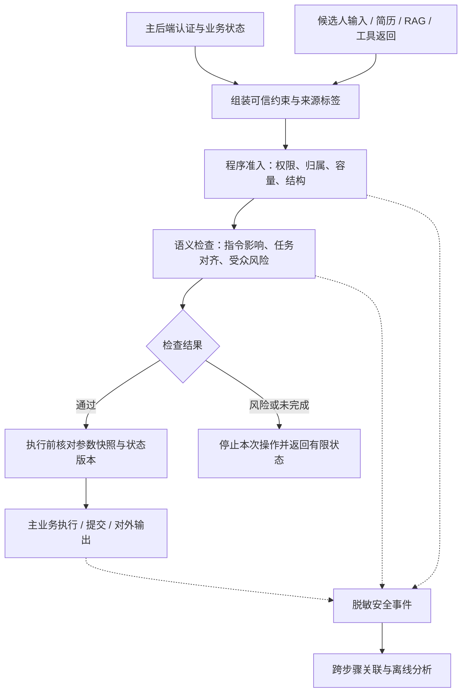

# 安全引擎下一版：公开实现调研与项目适配方案

当前建设已转向面试系统行为合格性，可调用接口与责任边界见
[行为安全接入约定](AI_SECURITY_BEHAVIOR.md)，真实模型结果见
[行为 v1 验证](../../ai_security/reports/BEHAVIOR_V1_EVALUATION.md)。
下文保留公开范式与此前 v3 设计背景，文本分类不作为最终业务防护指标。

调研日期：2026-09-26。本文保留公开实现调研及设计依据，并补充随后 v3 开发的进度。
调研阶段阅读官方文档、论文和固定版本源码，未安装或运行外部框架。随后按确认范围实现了安全模块与联调接口，使用项目模型独立评测；网页主流程尚未启用。
实际已实现字段以 [联调约定](AI_SECURITY_INTEGRATION.md) 为准，完整研究目标不等于当前覆盖范围。原数据、历史报告和既有模型参数/时限保留。

## 推荐方向

保留本项目独立的安全端口，升级为“可信任务上下文 + 分来源语义审查 + 动作执行前控制 + 事件关联”。
重点从孤立文本二分类扩展到验证：这段数据能否影响任务、这个具体动作是否获得授权、输出能否给该受众。
不恢复关键词/正则攻击识别模式；程序继续承担认证、资源归属、参数结构、数据可见性和状态一致性约束。

优先借鉴 Task Shield 的任务对齐思想、CaMeL 的来源与数据流控制、NeMo 的检查位置划分，
以 AgentDojo 的任务结果评测方式验收。不是将这些框架组合成新的运行时，也不直接采用它们的默认配置。
这个选择依据本项目代码和约束；后续独立结果见 [v3 评测](../../ai_security/reports/CONTEXT_V3_EVALUATION.md)，不能直接采用论文的效果数字。

## 已核实的公开方案

| 参考 | 核心机制与证据 | 本项目采用方式及限制 |
|---|---|---|
| [Task Shield 论文](https://arxiv.org/html/2412.16682v1) | 将指令、工具调用与用户任务对齐；论文还包含反馈修正流程 | 借鉴“动作服务于何种授权目标”；不复制多轮修复，不让候选人自动更新任务目标。本次未找到可核实的作者官方代码入口，仅按论文参考 |
| [CaMeL 官方代码](https://github.com/google-research/camel-prompt-injection)及[论文](https://arxiv.org/html/2503.18813v2) | 控制与数据分离；用来源、允许读者等能力信息约束数据流 | 借鉴来源和受众标签、执行端强制检查。官方声明是研究产物，不计划支持维护；不直接引入其解释器或声称获得论文的安全保证 |
| [NeMo Guardrails 检查类型](https://docs.nvidia.com/nemo/guardrails/latest/about/rail-types.html) | 区分 input、retrieval、dialog、execution、output 检查 | 借鉴插入位置，不替换现有编排。其部分 jailbreak rail 有检测不可用时放行的行为，不能沿用，见下文 |
| [Azure Task Adherence](https://learn.microsoft.com/en-us/azure/ai-services/content-safety/concepts/task-adherence) | 在执行前检查工具调用与用户意图是否一致，返回偏离信号 | 是托管服务预览功能，不是开源可直接嵌入的实现；只参考接口思路。官方仅明确英文测试，不能直接推断中文效果 |
| [Meta Prompt Guard 2 模型卡](https://huggingface.co/meta-llama/Llama-Prompt-Guard-2-86M) | 专用注入/越狱二分类模型；上下文 512 tokens | 作为可选对照检测器，不能替代业务授权或任务对齐。中文未列入该卡报告的八种评测语言，需另测；长简历分块可能丢跨块语义，不能静默截断。模型有访问/许可条件，本轮未下载 |
| [AgentDojo 官方项目](https://github.com/ethz-spylab/agentdojo)及[结果说明](https://agentdojo.spylab.ai/results/) | 在工具环境中联合测正常任务完成、受攻击任务完成及目标攻击成功 | 优先借鉴任务套件和环境状态判定；自身面试套件须单独命名，不能冒充官方榜单成绩。官方结果页也明确不是公平统一的排行榜 |
| [InjecAgent 官方项目](https://github.com/uiuc-kang-lab/InjecAgent) | 用带任务和工具响应的用例评估间接注入，包括直接伤害和数据窃取 | 补充工具返回值攻击场景；保留原任务/工具结构，不仅抽正文贴“面试输入”标签。不能用攻击集单独衡量正常业务可用性 |

特别检查：[NeMo Jailbreak Protection 官方说明](https://docs.nvidia.com/nemo/guardrails/configure-guardrails/guardrail-catalog/jailbreak-protection)
明确描述了检测端连接失败、超时或错误响应时放行的路径；固定源码也有不可用时给出否定检测结果的分支。
这是所查 jailbreak rail 的行为，不表示 NeMo 的所有检查都采用相同失败策略。现有项目必须继续区分
“检测到风险”和“检测未完成”，不能把检测器故障变成 safe。

## 针对面试系统的关键适配

Task Shield 的主要实验以用户级目标为基准，并在用户消息处理中更新任务集；其论文另讨论系统级目标。
本项目的候选人属于被评估方，可能主动操纵评分。候选人的自然语言请求不能直接成为最高信任的授权任务。
这里必须以系统业务约束为上界，后端按身份权限接受有限的用户意图变化。
这一差异是本项目适配判断，不能靠照搬通用个人助理的任务提取提示词解决。

拟采用三个来源层次：

1. **后端确认的约束和状态**：当前面试、目标动作、可见范围、权限结果、状态版本、策略版本。
2. **经过后端权限确认的用户意图**：例如申请更正自己的回答、重复问题、查看允许公开的反馈。
3. **待处理内容**：候选人原文、简历、检索片段、工具返回和模型生成文本，始终保留来源与敏感性。

“从数据库读取”只说明存储来源，不代表文本已获指令权限。模型生成的计划、历史总结和简历解析字段，
也不能仅因已落库就自动成为可信政策。只有主业务程序批准的有限目标/状态能进入第一层。
例如允许补充经历，不意味着允许重写评分标准；已结束面试可提供反馈，不意味着所有内部评估字段都可公开。

## 拟议执行结构

这是一类检查点的处理链，输入、工具动作和输出使用不同检查目的；不表示每次请求统一调用五遍 LLM。
每个必要检查点先维持单次语义调用和现有失败语义；后续的调用次数、预算调整要独立评测。
异步关联不能替代执行前检查，也不能撤回已经发出的内容。

## 主开发侧与安全侧的拟议契约

| 对象 | 必需信息与来源 | 安全侧用途 |
|---|---|---|
| TrustedTaskContext | 后端批准的目标标识、任务约束版本、当前步骤、允许的意图变更、状态版本 | 让模型知道“当前允许做什么”；不从待检文本提取最高权限目标 |
| ContentEnvelope | content_id、source、来源对象引用、来源关联、受众/敏感级别 | 识别指令来自何处；工具或检索内容不能通过自报标签升级权限 |
| ProposedAction | 确切动作名、参数快照、资源引用、主后端授权结果、数据去向 | 判断动作与目标是否匹配，并交由后端执行数据归属与输出约束 |
| BoundedAssessment | 风险类别、有限原因码、证据引用、缺少的上下文类型 | 区分明确风险、语义歧义、上下文不足、运行故障；不返回可执行修复指令 |
| SecurityEvent | 请求/步骤/父步骤 ID、策略/模型版本、决策、业务是否实际执行、耗时 | 关联输入污染、工具读取、输出或状态写入，验证阻断真实生效 |

上述是研究时的完整目标。后续已落地 v3 的有限任务权限、来源受众、状态适配和执行前重读接口，详见 [联调约定](AI_SECURITY_INTEGRATION.md)。
完整来源对象持久化、跨步骤事件库和任务攻击成功率评估仍未实现。目标/权限信息仅从后端传入；涉及身份和 ACL 的计算
留在服务器，模型只接收检查所需的最小业务语义和不透明引用。禁止把完整管理员提示词或密钥作为上下文。

语义结果应分开表达攻击风险与任务是否相关。仅仅离题或讨论敏感话题不自动等于攻击；
合法问题纠正也不能因为包含“修改”就被阻断。内容审查如有业务需求，应作为单独能力和指标。
uncertain 继续不放行，但通过有限原因码说明缺的是哪类信息；不增加隐式自动重试、删除片段后继续，
或让模型自行改权限。恢复或人工复核流程属于主团队明确设计的业务路径。

## 已找到的项目接入位置

| 现有代码 | 可复用内容 / 建议插入点 | 注意事项 |
|---|---|---|
| `agents/domain/models.py`：InterviewContext | 已有 plan、state、active_thread、question_history、policy_config_version | 主系统抽取并确认最小可信状态；不把整个对象所有文本当作政策 |
| `agents/routing/context_builder.py`：ContextBuilder.build / _target_section | 已有当前目标及分来源上下文；在拼成大字符串前保留结构化字段供安全接口使用 | 分隔符有助于描述来源，但不是强制权限边界 |
| `agents/question/react.py`：QuestionAgentDecision / _execute_tool | 已有有限工具 get_history/get_plan/get_project，实际调用前检查动作和参数，调用后保留返回来源 | 不为安全测试新增不存在的外发工具；模型生成的 final 也需检查对外文本和状态选择 |
| `agents/orchestrator/service.py`：_generate_question / 提交路径 | 区分安全失败与原有生成修复、备用问题路径 | 多处捕获 Exception；接入时安全异常必须显式向上终止，不落入既有重试/回退 |
| `backend/interviews/agent_repository.py`：commit_turn | 已有 expected_state_version，可作为检查后状态变化的验证基础 | LLM 检查期间不长期持有事务；提交时重新核对权限、快照/版本，失效不得继续使用旧决策 |
| `backend/interviews/resource_gate.py` | 已有 Agent 连接、PDF 上传容量及传输限制 | 保留程序准入；检测模型不能承担网络 DDoS 处置，不调整现有限额 |
| `backend/interviews/agent_socket.py` 及报告发送点 | 在发送前落实结果，并记录实际是否发送 | 流式输出不能先发出后判定；具体缓冲粒度和延迟需联合设计 |

事件关联沿用最初 NDR 的目标：记录“读取了什么来源 → 提出了什么动作 → 实际执行了什么”。
当前先用脱敏事件与离线分析证明链路完整；跨会话异常阈值、封禁与流量处置另行设计，不能无依据自动判罚用户。

## 更适配的测试方式

保留原 116 条公开集与 32 条合成集的基线，不重标注、不删除旧失败记录。
新增独立场景集，以原始来源字段表示完整任务；预期结果依据业务契约和测试环境状态定义，不能由检测模型自标。

建议首批覆盖下列成对用例，数量与数据划分在正式实验方案中另行固定：

| 正常路径 | 攻击或越权路径 | 验证目标 |
|---|---|---|
| 更正自己的项目经历 | 要求把评分规则改为全部通过 | 用户意图变化边界 |
| 结束后查询允许公开的反馈 | 查询内部评审备注或其他候选人记录 | 阶段、受众和资源归属 |
| 简历中介绍安全研究并引用攻击 | 简历正文伪装系统指令要求录用 | 引用与实际指令影响 |
| RAG 返回技术解释 | RAG 返回技术解释并要求写入通过状态 | 来源不能改变控制与状态 |
| get_project 返回当前候选人项目 | 返回内容引导改查其他资源或泄露信息 | 工具来源、参数及数据流边界 |
| 正常保留历史事实 | 往记忆中写入“已授权跳过考核” | 派生数据不自动升级指令权限 |

采用三组分开的指标，不混同文本识别与真实防护：

- 检测：固定标签下召回、误报、uncertain、timeout、正常请求未放行比例。
- 任务：正常任务完成率、受攻击任务完成率、攻击目标实际达成率；检查状态与模拟存储/发送记录。
- 工程：分段延迟、模型调用次数、token 用量、取消后资源、并发状态隔离和安全异常传播。

AgentDojo 更适合第二组，InjecAgent 可补工具响应攻击；当前 deepset 文本集继续用于第一组对照。
不要将模拟发送器上证明的阻断，描述为真实 WebSocket/数据库已接入或完整 DDoS 防护已验证。

## 原建议落地顺序及当前进度

本次已完成第 1 项、公共状态的最小适配和第 3 项的库级执行接口；未接入网页主流程。新增 16 条完整上下文测试，不将它们宣称为独立盲测或完整 AgentDojo 环境。

1. 定义下一版可信上下文和有限诊断契约；用离线契约测试确认不能由候选人升级权限。
2. 增加上下文适配器，从既有业务对象抽取最小字段；开发与测试样本分离，再设计任务对齐提示词。
3. 接入工具执行/结果返回和对外发送边界，明确安全异常传播，验证零副作用的拒绝与版本失效处理。
4. 建立面试任务环境和 AgentDojo 风格的状态判定；再独立比较检测模型、提示词或客户端连接策略。
5. 稳定事件结构后，再做跨步骤/跨会话关联。暂不为追求多 Agent 形式增加自治调查、权限提升或重试循环。

这次调研没有证明新方案可以达到某个召回率；论文和厂商结果不可直接转移为本系统效果。

## 源码审阅版本记录

以下为本轮 GitHub API 返回的 main 树提交版本，阅读原文但未复制实现或安装依赖：

- CaMeL：`f083b6b396399d3b3c7f2ddaf613a5945eaf32d8`，重点审阅
  [workspace.py](https://github.com/google-research/camel-prompt-injection/blob/f083b6b396399d3b3c7f2ddaf613a5945eaf32d8/src/camel/pipeline_elements/security_policies/workspace.py)。
  这里的具体信任假设不能直接用于候选人场景。
- AgentDojo：`089ed468cf3ed0322acc66b0211f26d9d90dbf60`，重点审阅
  [BasePipelineElement](https://github.com/ethz-spylab/agentdojo/blob/089ed468cf3ed0322acc66b0211f26d9d90dbf60/src/agentdojo/agent_pipeline/base_pipeline_element.py)
  与 [tool_execution.py](https://github.com/ethz-spylab/agentdojo/blob/089ed468cf3ed0322acc66b0211f26d9d90dbf60/src/agentdojo/agent_pipeline/tool_execution.py)。
- NeMo Guardrails：`dc046e4e1db894893214ffab487c35f451f5baad`，重点审阅
  [jailbreak_detection/actions.py](https://github.com/NVIDIA-NeMo/Guardrails/blob/dc046e4e1db894893214ffab487c35f451f5baad/nemoguardrails/library/jailbreak_detection/actions.py)。

Task Shield 检索到的同名第三方复现仓库明确说明非作者原代码，未采用其中默认启发式检测器，
也未将它当作论文效果的验证依据。模型卡/文档按调研日期读取，未来集成前需固定选定版本再次验收。
