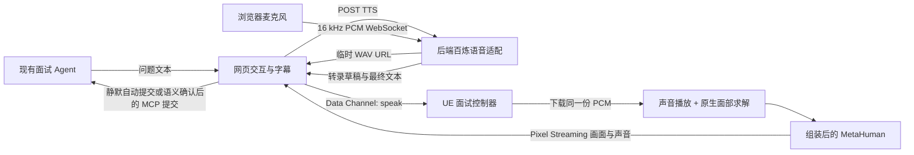

# 数字人面试官：启动、角色接线与验收

## 目前已实现什么

| 部分 | 当前状态 |
| --- | --- |
| 固定面试场景 | 已保存 `L_Interview`：背景、地面、主光/补光、胸部以上机位；已设为默认地图 |
| 控制器 | 已生成 `BP_InterviewerController`，管理 Idle / Listening / Thinking / Speaking / Interrupted |
| 原生音频桥接 | HTTP 下载新 WAV，在后台 CPU 完整准备口型曲线后开始播放；声音与插值口型使用同一播放时间线 |
| 网页数字人播放器 | 使用 Epic UE 5.8 官方 SDK；实际浏览器已显示打包场景并收到 UE 控制器反馈 |
| TTS | 已接入 Qwen3-TTS-Flash-Realtime，地区由根目录 `.env` 显式配置；实时 PCM 封装为整句 WAV，返回音频时长，临时音频有容量和期限限制 |
| STT | 已接入 Qwen-Audio-3.1-ASR-Flash-Streaming：浏览器 PCM → 语音 WebSocket → 中间/最终转录 → 可修改的回答框 |
| 面试闭环 | 接入原有 question / answer / finished 消息；支持 10 秒准备、5 秒静默自动提交及语义结束确认后的 MCP 提交，均交给原 Agent 评价 |
| 人物 Rig 与 Assembly | **已完成**；当前场景使用 UE Cine 组装的 `BP_MHC_Hannah`，Avatar 与 InterviewCamera 引用已核对 |
| 身体与录制表情 | Body 保持同一待机循环；Agent 计划有效时生成表情，原始录制的循环副本作为保底 |
| 注意力与语音节奏 | 倾听停顿时偶尔轻微点头；Thinking 小幅侧头与视线回归；Speaking 根据实际播放音频做轻微强调 |
| Speaking 表情衔接 | Face 保持同一动画实例；语音开始、结束和打断时短暂混合，正常说话时口型直接响应语音 |
| 云端英文语音 | **短句实测通过**：24 kHz PCM16 TTS 和 16 kHz PCM STT；尚未完成真实麦克风与技术术语的整轮验收 |
| 真人完整验收 | **尚未完成**：真实人物口型、身体动作、五轮面试及十分钟稳定性仍需现场确认 |

最新组装角色与场景已重新打包，人物可通过实际 Pixel Streaming 返回固定机位画面。帧率取决于场景、显卡与编码方式；当前机器的最新实测和限制见本文末尾，不能沿用早期短句测试的帧率。



数字人只负责呈现；简历分析、追问和评分由既有 Agent 负责。用户的麦克风不连接面试官口型，也不经 Pixel Streaming 上行。

## 人物资产与当前场景

本机当前人物已完成组装。地图为 `/Game/Maps/L_Interview`，控制器为 `/Game/Blueprints/BP_InterviewerController`，角色为 `/Game/MetaHumans/MHC_Hannah/BP_MHC_Hannah`。
已检查当前场景的 Avatar 与 InterviewCamera 绑定；不要为重复测试重建现有布景。以下组装步骤供新机器或新人物使用。

1. 在 UE 打开 `Content/MetaHuman/NewMetaHumanCharacter`，确认人物脸型、发型和服装。
2. 如编辑器要求登录 Epic 或确认协议，请由账户所有者完成对应界面。
3. 在 Rig 区域完成角色绑定，再执行 **Download Texture Sources**。
4. 在 Assembly 选择 **UE Optimized → Medium**，执行 **Assemble**。
5. 找到生成的角色 Blueprint。后续需要的是这个 Blueprint，不能把原始 Character 编辑资产赋给控制器。

Epic 的组装/绑定入口见 [MetaHuman Creator 入门](https://dev.epicgames.com/documentation/en-us/metahuman/getting-started-with-metahuman-creator)、[Live Link 角色设置](https://dev.epicgames.com/documentation/en-us/metahuman/realtime-animation-using-live-link)。

组装完成后，打开 UE 的 Output Log，将命令输入模式切换为 Python，运行：

```python
exec(open(r"D:\_Project\AiInterviewer\DigitalHuman\Tools\setup_scene.py", encoding="utf-8").read())
```

脚本复用已经创建的地图和控制器，不重建现有布景。只有一个 MetaHuman 文件夹下的 `BP_` 角色时会自动选择。
如果有多个角色，或角色保存在其他文件夹，先指定真实资产路径：

```python
import os
os.environ["INTERVIEWER_AVATAR_ASSET"] = "/Game/MetaHumans/YourCharacter/BP_YourCharacter"
exec(open(r"D:\_Project\AiInterviewer\DigitalHuman\Tools\setup_scene.py", encoding="utf-8").read())
```

把示例路径替换成内容浏览器中角色 Blueprint 的实际路径。也可以直接打开 `L_Interview`，放入角色，将它赋给 `InterviewerController` 的 **Avatar**。
已有 Avatar 不会被脚本替换；更换人物时在控制器的 Details 面板手动重新指定。

运行结果保存在 `DigitalHuman/Saved/InterviewSetup.json`。成功接线时 `avatar_bound` 应为 `true`。
按 Play 检查机位和材质，并为身体配置一个合适的站立待机循环。身体动画要与面部 Live Link 分开，不能用身体动画覆盖面部动画图。

控制器运行时为 Face 安装 `InterviewerFaceAnimInstance`，所有状态保持同一个实例，语音 Subject 为 `InterviewerAudio`。Face 复制 Body 的姿态和表情曲线，再由原有 Face Post Process 执行面部求解。不要禁用 Face Post Process，也不要在 Speaking 开始或结束时切换 Face 的 Anim Class。
`BP_InterviewerController` 的 `OnStateChanged` 更新 Body 动画蓝图中的 `InterviewState`。Body 的录制表情混合权重保持 1，供 Speaking 的眉眼混合使用；头颈姿态继续来自 Body，`HeadControlSwitch` 保持 0。

`ABP_InterviewerBody` 的原有动画图输出后增加 `Interviewer Head Motion` 节点，统一处理颈部和头部的小幅动作。原有待机、身体后处理与 Face 跟随 Body 的方式继续使用。不要再单独旋转 Face 组件或启用 Face 的头部覆盖。

在测试页点击 **Preview local behaviour**，再点击 **Preview listening rhythm**，可以用 17 秒的本地模拟语音活动检查偶尔点头和视线配合，不打开麦克风，也不调用模型。Thinking 的动作间隔较长，切换后观察几轮即可。Speaking 可以复用缓存音频；正常语音口型仍由原生音频求解器控制。

### 调整表情与 Speaking 过渡

`AS_MHP_Listening_Loop` / `AS_MHP_Thinking_Loop` 是原始录制的副本，首尾约 0.35 秒接缝已处理；眉毛、待机嘴部和视线分别减弱，完整眨眼保留。原始 `_01` 资产继续保留。

需要调整 Speaking 效果时，在 UE 中打开 `L_Interview`，停止 Play，在大纲中选中 `BP_InterviewerController` 的实例。在 Details 搜索 `Face`：

- `Face Transition Seconds` defaults to 0.3 seconds for speech entry, interruption and failure.
- `Face Speech Release Seconds` defaults to 0.8 seconds for normal speech completion. The last visible mouth and expression gradually blend into the next quiet state; audio ends immediately. The duration is fixed at the transition boundary. Increase this value slightly if the release still feels abrupt.
- `Speaking Recorded Upper Face Weight` defaults to 0.3 for recorded fallback. With a healthy presentation Agent plan, generated blink, gaze and upper-face behaviour take priority; the audio solver retains mouth movement.

The updated Windows package passed 10 offline checks on 2026-10-04, including the longer completion release, continuity when another utterance starts during that release, actual cached speech playback, and interruption. The report is `DigitalHuman/Saved/SpeechReleaseValidation/Automation/index.json`. Tests reused the saved English WAV without provider calls and closed their temporary processes afterward.

保存关卡后重新打包，网页会使用新设置。Play 期间的临时修改停止后不会保存。Face 动画实例自身的 `Recorded Expression Strength` 保持默认 1；循环副本已降低强度，避免重复衰减。初次验证先保持默认设置，只观察朗读前、朗读结束与打断后的变化。

## 配置后端语音

在 **项目根目录 .env** 增加以下设置；终端 MVP 与后端共用该文件，已有配置文件不要覆盖：

```dotenv
SPEECH_ENABLED=true
SPEECH_REGION=singapore
DASHSCOPE_API_KEY=<与 SPEECH_REGION 对应地域的 key>
DASHSCOPE_SPEECH_WORKSPACE_ID=
SPEECH_TTS_MODEL=qwen3-tts-flash-realtime
SPEECH_TTS_VOICE=Cherry
SPEECH_STT_MODEL=qwen-audio-3.1-asr-flash-streaming
DJANGO_SECRET_KEY=<独立生成的 Django secret>
```

语音服务默认 `SPEECH_ENABLED=false`、`SPEECH_REGION=singapore`；未设置地域的协作者保持原有新加坡行为。
如复用北京地域的现有 Key，仅在自己的根目录 `.env` 设置 `SPEECH_REGION=beijing`，不替换 Key、不改文字模型配置。
仅支持 `singapore` 和 `beijing`，空值或其他地域明确报配置错误，不从文字模型地址推断地域、不自动跨地域重试。
启用前，在百炼控制台确认两个模型的权限、免费额度有效期和余量；对支持的模型启用 **Free Quota Only**。
代码不能替你开通控制台的免费额度限制；额度错误会显示 `quota_exhausted` 并保留文字操作。
不能从现有 LLM 的额度推断语音模型也有免费额度。

语音合成和识别同时按地域选择各自的官方地址：

```text
# SPEECH_REGION=singapore（默认）：STT / TTS
wss://dashscope-intl.aliyuncs.com/api-ws/v1/inference
wss://dashscope-intl.aliyuncs.com/api-ws/v1/realtime
# SPEECH_REGION=beijing：STT / TTS
wss://dashscope.aliyuncs.com/api-ws/v1/inference
wss://dashscope.aliyuncs.com/api-ws/v1/realtime
```

它们独立于 LLM 的 OpenAI-compatible `DASHSCOPE_BASE_URL`。Key 必须与语音地域一致，不能跨地域混用。
`DASHSCOPE_SPEECH_WORKSPACE_ID` 可留空；如显式配置，STT 使用该地域的工作空间域名：
新加坡为 `{workspace}.ap-southeast-1.maas.aliyuncs.com`，北京为 `{workspace}.cn-beijing.maas.aliyuncs.com`。
TTS 保持所选地域的公开 realtime 地址。设置地域不改变模型、音色、音频格式和超时默认值。
地址契约见 [TTS SDK](https://www.alibabacloud.com/help/zh/model-studio/qwen-tts-realtime-python-sdk) 和
[ASR WebSocket](https://help.aliyun.com/zh/model-studio/qwen-audio-asr-streaming-websocket-api)。

原始数字人集成验收使用新加坡凭据、`qwen3.7-plus` 文字模型及 `qwen-audio-3.1-asr-flash-streaming`。
该记录不代表其他机器的本地配置或模型额度；每位协作者维护自己的被 Git 忽略的 `.env`。
TTS 的 `qwen3-tts-flash-realtime` 与 ASR 单独计费和核算额度，ASR 额度不能用于文字转语音。
Qwen TTS 使用新的专用 SDK 适配；把 CosyVoice 的 model 字符串换成 Qwen 名称不足以兼容协议。
当前适配支持 Qwen3-TTS-Flash-Realtime 系列与 Qwen-Audio-3.0/3.1-ASR-Flash-Streaming；HTTP TTS、Voice Design、声音注册和 Fun-ASR 文件识别不能直接填入这些实时模型配置。
默认音色 `Cherry` 支持英文；可按 [官方音色列表](https://help.aliyun.com/en/model-studio/qwen-tts-voice-list) 选择匹配的预设音色。
参考 [Qwen realtime TTS SDK](https://www.alibabacloud.com/help/en/model-studio/qwen-tts-realtime-python-sdk)、[Qwen streaming ASR SDK](https://docs.modelstudio.console.alibabacloud.com/en/model-studio/qwen-audio-asr-streaming-python-sdk)、[免费额度说明](https://www.alibabacloud.com/help/en/model-studio/new-free-quota)。

在仓库根目录启动后端：

```powershell
.\.venv\Scripts\python.exe -m pip install -r backend\requirements.txt
.\.venv\Scripts\python.exe backend\manage.py migrate
.\.venv\Scripts\python.exe -m uvicorn config.asgi:application --app-dir backend --host 127.0.0.1 --port 8765 --ws websockets-sansio
```

已有 `.venv` 可直接复用；新机器先创建 Python 3.11+ 虚拟环境。模型问题由现有 Agent 生成，其配置见 [Agent 接入说明](../../backend/docs/agent-integration.md)。
`manage.py runserver` 不能提供这里的语音 WebSocket。

## 启动 UE 与网页

需要 Node.js 22+、pnpm、Git 和本机 UE/Visual Studio C++ 工具链。首次构建串流依赖，在仓库根目录执行：

```powershell
.\DigitalHuman\Tools\setup-streaming.ps1
```

脚本安装 UE 5.8 官方 Infrastructure 的 Common/Signalling 库，并构建网页 SDK 包。
网页播放器源码、构建配置和测试统一维护在 `backend/frontend/digital-human/`；后续由后端团队迁入根目录 `frontend/`。
只重建播放器时，在仓库根目录执行 `pnpm --dir backend/frontend/digital-human run build`，
语音前端测试执行 `pnpm --dir backend/frontend/digital-human test`。
本次使用的官方源码版本为 `6b8cfb460bda09703e85178f1f77aa6faec9e890`。
下载目录、node_modules、打包输出和 UE 缓存均被 Git 忽略。

在两个额外终端分别运行：

```powershell
# 终端 2：本机信令。仅监听回环地址，不需要公网 STUN/TURN。
.\DigitalHuman\Tools\start-signalling.ps1
```

```powershell
# 终端 3：已打包的 UE 程序，1920×1080，帧率上限 30。
.\DigitalHuman\Tools\start-digital-human.ps1
```

打开 `http://127.0.0.1:8765/agent/`，点击 **连接／播放数字人**。
信令地址保留 `ws://127.0.0.1:8889`。浏览器首次播放需要点击；正式业务页面迁移时也要保留用户触发播放的入口。
使用一个浏览器会话。当前基础设施最多允许一个播放器订阅同一 UE 进程。

开发期间也可用 `start-digital-human.ps1 -EditorGame`。最终验收应关闭编辑器并使用打包版本。
当前 UE 5.8 实际支持的参数是 **`-PixelStreamingConnectionURL`**，不是 `-PixelStreaming2ConnectionURL`。

### 本机 GPU 接入已部署网页

服务器端信令与 TURN 配置见 [部署说明](../../deploy/README.md)。完成配置后，渲染电脑
不需要再启动本机后端或本机信令；在仓库根目录的两个终端分别运行：

```powershell
# 终端 1：保持 SSH 隧道运行，服务端的 UE 信令端口仍只监听回环地址。
.\DigitalHuman\Tools\start-render-tunnel.ps1 -Server 47.239.50.129
# 终端 2：本机渲染，默认 1080p / 30 FPS。
.\DigitalHuman\Tools\start-digital-human.ps1
```

登录已部署网页后点击数字人连接按钮。网页从 `/api/avatar/config/` 获取同源
`/ws/avatar/` 连接地址；HTTPS 页面不回退到用户电脑的本机信令地址。
SSH 使用正常账户认证，脚本不保存密码。渲染期间保持电脑、EXE 和 SSH 隧道在线。

### 重新打包

新增或修改人物/动画资产后必须重新打包：

```powershell
.\DigitalHuman\Tools\package.ps1
```

运行目录为 `DigitalHuman/BuildOutput/Windows`，上传云渲染平台使用 `DigitalHuman/BuildOutput/DigitalHuman.zip`。ZIP 放在运行目录外，避免再次压缩时包含旧 ZIP。
脚本默认引擎位置 `D:\Epic Game\UE_5.8`，其他机器可传入 `-EngineRoot`。每次使用全新归档目录，成功后将上一个包备份至 `Saved/AssetCleanup/BuildBackup-*`，再替换标准运行目录。Development 配置保留自动化测试能力，上传包不含 PDB 调试符号。

原生口型模型由 `Tools/configure_runtime_cook.py` 读取当前引擎的 `GetLatestModelAssetPath()`，通过 `RuntimeAssets/PAL_InterviewerSpeechModel` 精确 Always Cook。不要删除该标签：模型由 C++ 字符串加载，不会自动出现在地图的资源引用中。

当前发布包只提供语音驱动面试官。Windows cook 排除 `GenericTracker` 图像跟踪目录，另用 `PAL_EditorVideoTrackingModels` 排除三个视频推理模型，并保留 Live Link 的共享 smoothing。工程关闭用于 Path Tracer 的 `NNEDenoiser`；实时场景继续使用 Lumen，原生口型所需的 `NNERuntimeORT` 保留。引擎中的面捕模型、角色源资产、Identity、Performance 和录制源素材仍在编辑器中可用；后续若发布视频面捕或 Path Tracer 功能，需要相应调整这些配置。

`Tools/audit_asset_usage.py` 输出含硬引用、软引用及编辑器引用的资源报告到 `Saved/AssetCleanup/asset-usage.json`。清理仅移出无其他资产引用的旧组装资源，不按“未进入 cook”直接删除录制或角色源文件。被移出的文件及校验清单位于 `Saved/AssetCleanup`，该目录不进入 Git 或部署包。

## 模拟面试操作

1. 点击数字人连接/播放按钮，确认角色可见。
2. 填写英文简历和目标岗位，开始面试。
3. 后端返回完整问题，网页显示字幕并请求 TTS。
4. 自动朗读结束后准备 10 秒，倒计时结束自动开启麦克风；关闭朗读或主动打断时直接进入准备阶段。首次需授权浏览器麦克风，可用中文或英文回答。
5. 连续静默 5 秒或检测到结束意图时自动收尾，等待完整最终转写。回答最多 120 秒，到限也自动收尾。
6. 字幕用于查看转写，完整回答自动提交；页面不提供回答编辑或手动开始／提交按钮。可随时通过 **结束面试** 选择评判并保存、结束且不保存或继续。
7. 下一题重复上述过程，最终显示原有 Agent 生成的报告。

临时转录不触发追问。正常情况下声音只由 UE 播放；数字人不可用时才由浏览器播放语音。
拒绝麦克风权限、语音模型失败或串流断线时可以继续文字回答。
点击 **打断朗读** 会取消本地下载、口型计算和播放，并恢复回答操作；已发出的云端 TTS 请求不保证在供应商处立即取消。

## 语音接口

| 接口 | 输入 / 输出 |
| --- | --- |
| `POST /api/speech/tts/` | `{"text":"..."}`，最多 1200 字符；返回 `utterance_id`、`audio_url`、`sample_rate`、`generation_ms`、`duration_ms` |
| `GET /api/speech/audio/<uuid>/` | 24 kHz、mono、PCM16 WAV；缓存最多 16 段/32 MiB，10 分钟过期 |
| `/ws/speech/stt/` | hello → `{"type":"start"}` → PCM 二进制 → `{"type":"stop"}` → final |

STT PCM 为 16 kHz、mono、PCM16 little-endian，每片不超过 8192 字节。
前端 AudioWorklet 直接生成 PCM，不发送 MediaRecorder 的 WebM/Opus 分片。
中间事件为 `partial`；最终事件为 `final`，含 `text` 和 `finalization_ms`。
后端 15 秒内未得到最终转录会失败；SDK 网络任务另有 140 秒总超时。

UE 控制消息：

```json
{
  "type": "speak",
  "utterance_id": "<TTS 返回的 UUID>",
  "audio_url": "http://127.0.0.1:8765/api/speech/audio/<相同 UUID>/"
}
```

其余消息为 `{"type":"stop"}`、`{"type":"state","state":"listening"}`。
UE 返回 `playback_started` / `playback_finished` / `interrupted` / `playback_failed`，携带同一个 `utterance_id`。
网页以问题生命周期和语音 ID 隔离旧响应，旧音频完成事件不能释放新问题的控件。
UE 下载地址固定为本机 `8765` 的语音路由；更换后端端口需要同步调整 C++ 校验并重新编译。

## 验证与剩余验收

2026-10-04 已在更新后的 Windows Development 包中通过 8 项表情与音频 Automation 检查：边界连续性、首帧等待、快速反向切换、Source 丢失、上半脸混合、角色绑定、完整语音播放过渡及原生音频播放/打断。复用了本地 3.28 秒英文 WAV，没有调用云端模型；完整播放产生 105 帧、251 条表情曲线，正常结束与打断后过渡完成，Face / Body 实例保持不变。报告为 `DigitalHuman/Saved/FaceTransitionFix/Automation/index.json`。网页中的表情自然度由使用者手动确认。

本轮已通过：Python 核心测试、Django/ASGI 测试、前端 PCM/生命周期测试、原有真实网络离线联调、注释契约检查、Windows 打包和实际浏览器 Data Channel 往返。
实际打包程序运行 `Interviewer.NativeAudioSmoke`，检查动态下载、声音播放、原生动画帧生成、第二段音频和主动打断。
2026-10-01 的打包验证通过：第一段生成 126 帧原生动画数据，第二段播放后成功打断，音频停止且 Live Link Subject 被移除。
Qwen 适配迁移后重新运行后端测试；前端 PCM/生命周期的 6 项测试此前通过，接口保持兼容。依赖一致性与注释契约检查通过。

2026-10-01 另执行了一次真实新加坡语音调用：输入 58 字符的公开测试句，TTS 约 1375 ms 返回 3.28 秒、24 kHz 单声道 PCM16 WAV。
将该音频转换成 16 kHz PCM 并实时发送给 STT，最终识别为 `Could you describe your main contribution to this project?`。
测试没有使用简历或用户麦克风；它证明短句云端调用可用，不证明实际面试中的识别精度。
测试音频与识别结果位于 `DigitalHuman/Saved/SpeechValidation`，该目录不进入 Git。

离线音频测试需要停止真实后端，另开终端运行 `DigitalHuman/Tools/audio_smoke_fixture.py`，然后对 Windows Development 包运行该 Automation 测试。
在仓库根目录运行：

```powershell
# 终端 1：专用离线音频端点，不能与真实后端同时占用 8765。
# 缓存 WAV 已存在时可重复检查英文播放，不调用云端模型。
.\.venv\Scripts\python.exe DigitalHuman\Tools\audio_smoke_fixture.py --wav DigitalHuman\Saved\SpeechValidation\qwen-question.wav
```

```powershell
# 终端 2：测试完成后 UE 自动退出，退出码应为 0。
$audioTestArgs = @(
    '-RenderOffscreen', '-AudioMixer', '-ResX=1920', '-ResY=1080', '-Windowed',
    '-ExecCmds="t.MaxFPS 30,Automation RunTests Interviewer.FaceTransition+Interviewer.AvatarBinding+Interviewer.FaceSpeechPlayback+Interviewer.NativeAudioSmoke,Automation Quit"',
    '-ReportExportPath=D:/_Project/AiInterviewer/DigitalHuman/Saved/NativeAudioTest'
)
$audioTestProcess = Start-Process -FilePath '.\DigitalHuman\BuildOutput\Windows\DigitalHuman\Binaries\Win64\DigitalHuman.exe' -ArgumentList $audioTestArgs -WindowStyle Hidden -Wait -PassThru
$audioTestProcess.ExitCode
```

本项测试不需要浏览器或信令服务；结束后在终端 1 按 Ctrl+C，释放真实后端的端口。
不传 `--wav` 时使用明确标记的合成音调。过渡测试检查开始、结束、首帧等待、Source 丢失和快速反向切换；播放测试检查原生求解、持续的面部实例与恢复 Listening。数值检查后仍需由使用者在网页观察面部自然度。
报告位于 `DigitalHuman/Saved/NativeAudioTest/index.json`，启动/串流日志位于 `DigitalHuman/Saved/Logs`。

人物和云服务配置完成后，执行以下最终验收：

- 两个刚合成、未导入 Content Browser 的英文问题均有声音和对应口型。
- 连续五轮：问题、字幕、声音、转录和 question_id 对应；修改后的确认文本进入评价。
- 打断后声音和嘴部动画均停止，下一题不会继续旧动画。
- 验证麦克风拒绝、TTS/STT 失败、音频过期及 Pixel Streaming 断线的文字操作。
- 关闭编辑器，以打包程序连续运行十分钟；核对人物材质、身体姿态和动作。

网页分别显示问题等待、TTS 生成/请求、UE 播放准备、STT 收尾时间及接收帧率。
“问题等待”包括后端业务处理和模型调用，不等同于纯模型推理时间。
新语音在后台 CPU 工作线程完整准备口型后才开始播放，逐个处理 20 ms PCM 块，再按声音播放时间插值面部曲线。每句清空模型的循环状态，只复用模型实例，音频和动画均来自本次新语音。取消操作会丢弃迟到结果。`Speech.AudioDelaySeconds` 保留以兼容旧资产，不再用于设置播放延迟。

网页按有效的 `duration_ms` 将 UE 准备超时限制在 18–125 秒；缺少或无效的时长仍使用 18 秒。问题朗读完成后才开始完整的 10 秒回答准备计时，重播和结束面试弹窗会暂停并保留剩余时间。

The launcher outputs 1920×1080 and uses UE's default media-capture and GPU-fence path, with both rendering and WebRTC capped at 30 FPS. Hardware H264 encoding remains the default; `start-digital-human.ps1 -SoftwareEncoding` selects VP8 only for an explicit software-encoder diagnostic. With `-Diagnostics`, playback responses include preparation and solve times, prepared and displayed frame counts, and audio/curve clock measurements. These launch changes require restarting the packaged application, not repackaging it.
这些时延、角色帧率和十分钟稳定性不能从空场景或合成音调测试推断。

### 2026-10-04 新生成媒体的正式接口测试

使用正式简历、面试、TTS、表情计划及 STT 接口，并通过实际 WebRTC 接收打包程序的画面和声音。所有语音均在本轮新合成，没有加载旧 WAV、视频或口型片段作为测试输入；STT 输入是一段本轮新合成的英文回答，用于测试协议，不代表实体麦克风验收。

- 两轮新问题均完成动态朗读和原生口型：音频时长 9.68 / 8.08 秒，口型准备 3.48 / 2.95 秒，曲线分别为 485 / 405 帧，准备时间线间隔 20 ms。
- 两轮在 UE 内完整播放到句尾并有持续变化的嘴部曲线；声音和曲线共用播放时钟。该记录不等于测量了扬声器与显示器的实际延迟。
- 两次真实表情模型计划成功应用；实时 STT 产生最终文本并提交，识别结束收尾约 531 ms。
- 硬件 H264 路径出现 NVENC 输出锁定错误和 `GPU Crashed / D3D Device Removed`；软件 VP8 持续返回新画面，但约 3.2 FPS。不能据此宣布画面和口型观感已达到流畅目标。
- 两轮回答和报告模型调用已执行，最终报告发布被项目安全模块以 `security_denied / OUTPUT_CONFIDENTIALITY` 拦截；没有绕过安全模块或修改 `agents/`，完整报告闭环未通过。

原生时间线、过渡与绑定的 12 项离线检查通过；前端 49 项检查和语音 HTTP 的 3 项检查通过。离线检查不调用额度，也不加载缓存音视频。详细实测记录位于 `DigitalHuman/Saved/SpeechSyncValidation/FreshFormal20261004/metrics.json`；测试账号、简历和面试记录已清理，测试服务已关闭。

2026-10-04 后续修复了报告公开边界：岗位评分权重、内部规划和评价器控制字段保留在后端，
最终响应提供问答、个人评价、必要状态及报告。保密规则明确允许候选人自己的已授予分数和
答案引用，仍禁止内部评分规则、系统提示词、私人参考答案及其他人的数据。
真实单题文本流程用新问题和一次英文回答复验通过，报告批准发布，历史记录为 completed，
六个能力维度与此前的 assessment 一致；耗时 37.3 秒，33 项接口与持久化检查通过。
本次没有调用语音或数字人媒体服务，不代表 GPU 串流问题已解决。
记录为 `tmp/formal-text-report-20261004-215931-6f50ba8d/metrics.json`；安全、持久化和进度的
40 项离线回归通过，泄密样例、未知岗位字段和未批准的旧响应仍被拦截。

2026-10-04 帧率对照恢复默认捕获与 GPU fence，使用 H264、1280×720 和 30 FPS 上限，
保留人物及场景质量。仅渲染的 20 秒协议探针接收约 15.0 FPS；随后真实单题面试的新 TTS
朗读接收约 15.1 FPS，口型 7.44 秒内更新 110 次，问题、播放和报告均完成。
两次为同配置对照，没有控制浏览器，也没有用旧缓存媒体作为输入；正式流程只合成了一段
新问题语音，使用文字回答，未调用 STT。记录为 `tmp/formal-flow-20261004-220910-a83c527b/metrics.json`
和 `tmp/formal-flow-20261004-221709-f58d3125/metrics.json`。
本次未复现正式流程额外掉帧，仍未达到 30 FPS，实际网页观感需使用者确认。
稳定帧的 CPU 游戏线程中位数约 4 ms、GPU 约 66 ms，头发可见性渲染约 20 ms；
同时 GPU 负载 99%、核心约 292 MHz，并报告 Reliability 限频状态，其具体原因尚未确定。
此前约 3 FPS 来自 VP8 的 Python 接收端，不能直接视为网页帧率，也不能把不同编码的结果
解释为单个参数带来的提升。性能摘要保存在 `tmp/frame-baseline-csv-summary.json` 和
`tmp/frame-formal-csv-summary.json`。测试数据已清理，测试服务已关闭。

2026-10-04 重启后复测采用相同人物、场景、H264 和 720p／30 FPS 上限：基础探针接收
30.04 FPS，真实单题朗读接收 29.87 FPS；本轮新 TTS 时长 6.96 秒，口型更新 209 次，
问题、播放、报告及历史保存均通过。没有使用旧缓存媒体，仅新合成一段问题语音，回答
通过文字提交，未调用 STT。GPU 核心在采样时约 1425–2190 MHz，此前的约 292 MHz
低频状态已解除，具体触发原因尚未定位；没有降低资产质量或修改显卡设置。
基础 CSV 的 GPU 中位耗时约 7.12 ms；正式流程 CSV 约 6.82 ms，覆盖出题、TTS、口型
准备和朗读前约 0.47 秒，不能视为完整播放期间的 GPU 测量。完整朗读的帧率和口型
频率由接收探针及原生播放诊断记录；最大面部更新间隔约 79 ms，并非每帧都严格 33 ms。
记录为 `tmp/formal-flow-20261004-224750-b95b0a98/metrics.json` 和
`tmp/formal-flow-20261004-225012-dd162e29/metrics.json`；测试数据和服务均已清理。

## 文件职责

Facial presentation consumes initial Idle context and approved questions through an independent backend service and the existing Pixel Streaming channel. Agent profiles drive Idle, Listening, Thinking and Speaking; recorded facial clips are failure fallback. Audio lip sync retains control of the mouth during speech. It does not change `agents/`, question generation, answer submission or scoring. Local previews and the bounded protocol are documented in [digital-human facial presentation](../../backend/docs/digital-human-presentation.md).

| 文件 | 职责 |
| --- | --- |
| `DigitalHuman/Plugins/InterviewerRuntime` | 原生 WAV 播放、CPU 口型求解与插值时间线、状态和 Pixel Streaming 消息 |
| `DigitalHuman/Tools/setup_scene.py` | 生成/复用地图、控制器、摄像机，绑定已组装人物 |
| `DigitalHuman/Tools/*streaming*.ps1` / `local-signalling.cjs` | 官方依赖构建和仅回环的信令服务 |
| `DigitalHuman/Tools/start-digital-human.ps1` / `package.ps1` | UE 运行参数与打包 |
| `backend/interviews/speech` | 密钥、地区、TTS、STT、临时 WAV 缓存及访问策略 |
| `backend/interviews/presentation` | Independent four-state facial behaviour profiles and recorded-animation fallback |
| `backend/frontend/digital-human/src/presentation-controller.js` | Plan requests, cancellation and question/audio correlation |
| `backend/frontend/interview-voice.js` | 页面语音状态、异常降级及旧事件隔离 |
| `backend/frontend/speech-capture.js` / `speech-worklet.js` / `pcm-resampler.js` | 采集、重采样、最终转录边界 |
| `backend/frontend/digital-human` | 官方 Pixel Streaming SDK 包装、构建和前端测试 |

数字人呈现仍需本机 GPU 运行；尚未加入流式 TTS、自动语音打断、声音克隆或招聘者端。
网页自动结束回答见[结束检测说明](../../backend/docs/answer-completion.md)，公网后端配置见
[部署说明](../../deploy/README.md)。两者不代表真实数字人设备体验已经验收。
