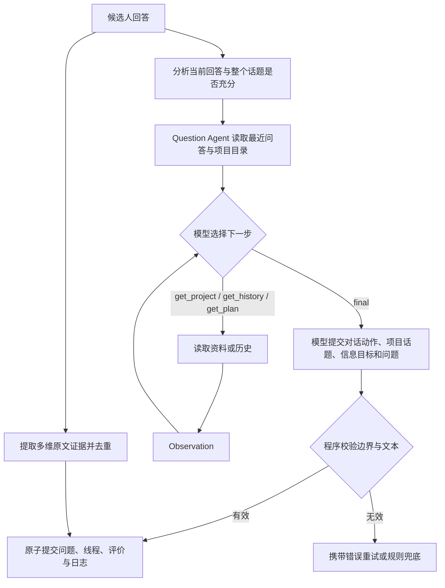

# 对话驱动出题：已实现方案

## 设计结论

出题不预选能力，也不提供 evaluation_hints。一个自然的问题可以产生多个能力维度的证据；具体评估哪些能力，等候选人回答后再决定。能力评分、覆盖度、岗位能力权重均不参与选题或追问。

confidence、evaluation_confidence、target_confidence 及其门槛、排序、报告字段已移除。保留的 evidence strength 描述原文证据的具体程度，不是模型自报“有多确定”；coverage 和 evidence_count 只用于评价报告，不能用来驱动补题。

## 正式流程



当前默认由 Question Agent 自主决定对话动作、项目、话题和信息目标，同时选择所需工具。程序校验有效项目/话题、追问关联、次数、时间及重复目标，并负责原子提交。旧对话规则仍预备一份兜底计划，但不传给自主模式的模型；仅在模型失败或禁用 ReAct 时使用。信息充足时可直接 final，不强制调用工具。

## 对话决策与边界

以下前 3 项是模型的对话判断指引，不再由 Python 直接决定最终动作；预算、有效 ID 等限制由代码校验。

1. partial / non_answer：优先澄清上一答缺少的一个具体信息。
2. contradictions：优先核对相互不一致的陈述。
3. substantive 但仍有具体缺失信息：继续深挖该信息。
4. explicit_unknown / refusal：程序禁止继续追问当前线程，模型选择其他话题或项目。
5. 默认连续两答无新信息、同一信息目标已经问过、达到话题或项目题数上限、或剩余时间不足时，停止当前线程。
6. 模型自行决定继续当前项目还是换项目，只能使用目录中未问过的话题；所有话题耗尽且当前线程不能继续时结束。

项目与话题采用独立的总题数预算，主问题和每次追问都计数。默认每项目 4 题、每话题 3 题；可以通过配置或入口参数调整。话题额度用完但项目仍有额度时，可以在同项目开启新的信息目标；项目额度用完后，全部话题（包括未问话题）都不可再选，必须切换其他项目。没有可问项目时提前结束，不为凑足整场题数重新打开项目。

所有预算、话题关闭和线程切换统一由 agents/policies/dialogue_controller.py 管理。计数从持久化的 active_thread 与 closed_threads 累加，每个线程计 1 + follow_up_count；不从可裁剪的问答历史计算，也不另存一套容易失配的计数器。切换话题、切换阶段、进程重启不会清零；模型重试、未提交的冲突尝试、重复反馈不增加题数。

每个新话题建立 thread_id，追问保持 thread_id，parent_question_id 关联紧邻上一题。已关闭话题的 ID 和信息目标跨线程保留，同项目内规范化后完全相同的信息目标不能通过换标签再次提问。语义近似但措辞不同仍可能漏检；项目总预算是独立的硬边界，无法靠不断声明 new_topic 绕过。

例如每项目 4 题、每话题 2 题时：项目 A 的话题一问第 1、2 题，话题二问第 3、4 题；第 5 题必须来自其他项目。无需先问满每个话题，可以根据回答提前切换。

新入口参数为 --max-questions-per-project 和 --max-questions-per-topic。旧 --max-follow-up-per-topic N 仅在入口转换成每话题 N+1 题，不能与新话题参数同时传入。旧计划中的 max_consecutive_probes 读取时同样转换；保存只输出两层总题数。无完整线程信息的旧会话建议重新开始。

日志明确显示项目名称、项目已问题数/上限、话题已问题数/上限、所属主问题及关联上一题。一场面试仍只生成一个 Markdown 文件。

模型根据岗位、项目目录和对话选择项目；话题目录来自简历主张、技术和指标，不按能力枚举。初始输入只包含目录、状态和最近一轮问答；完整项目资料通过 get_project 读取，较早历史通过 get_history 读取。get_project 访问现有结构化简历，不是 RAG。旧的可选 RAG 路由只在非自主模式使用。语义相近但措辞不同的话题和信息目标仍可能重复，程序只作明确 ID 和规范化文本检查。

## 多维评价与去重

EvaluationFeedback 分为两部分：

- analysis：回答状态、缺失信息、待澄清信息 uncertainties、矛盾及其原文依据 contradiction_evidence、新信息标志、事实摘要，以及 answer_scope（标签/具体内容等）和 thread_complete（整个话题是否充分）。
- dimensions：零到多个维度，每个维度包含 competency、原文 quote、fact、rationale、observation、可空 rubric_level 和 strength。

出题模型只能读第一部分及问答原文；历史工具不暴露 dimensions 或能力评分。每个维度的引文必须是当前回答的原文子串，不能拿简历或面试官的问题当成候选人的表现。yes/ok 等非回答不会获得能力分；没有观察到的能力保持 score=null，不能默认判低分。

回答评价只读取当前 thread 内的历史，不把同项目已结束话题的疑点带入当前回答。yes/ok 等非回答会清除矛盾和待澄清疑点，下一步应澄清当前问题缺少的具体信息。Question Agent 仍可主动查阅较早历史作为背景，但提示词禁止以追问当前回答的名义重新开启已结束话题。证据聚合仍保留整场记录用于去重与报告。

回答 background 这类单个任务名称可能已经回答了当前澄清问题，但不代表整个话题充分，更不能据此认定技术能力。标签型回答不产生评分证据；thread_complete 被保持为 false，模型可继续询问实现细节。单个短英文词还有程序层的保守保护，其他表达由评价模型按上下文判断。

“某技术一般用于什么”和候选人说法不同，不能直接判为矛盾。评价模型必须指出两次明确且互斥的回答，并提供之前的 answer_id 和两段原文引文；程序核验引文确实来自对应回答。缺少有效依据的矛盾标记会降为待澄清信息，标签型回答不据此判矛盾。原文核验只能确认来源，不能保证模型对语义互斥的判断总是正确。

同一项目、同一对话线程的同维度证据按一条聚合；相同事实或相同引用跨线程出现也合并，防止一次经历经过追问后重复计分。更具体的证据更新记录；发生矛盾时允许新证据修正此前记录。当前合并规则比较规范化事实文本，并不保证识别所有语义重复。

总分只对已评分维度按岗位权重聚合。报告明确说明未观察维度不计分；它不意味着整场能力已经完整测量。模型生成优缺点文字，数值和计分范围由代码生成。

## 文件与接口

| 文件 | 实现 |
| --- | --- |
| agents/question/dialogue.py | 精简目录、模型选择结构、程序边界校验 |
| agents/policies/dialogue_policy.py | 模型失败或禁用时的规则兜底 |
| agents/policies/dialogue_controller.py | 两层题数预算、已问目标、话题关闭与原子提交前的线程切换 |
| agents/policies/probe_controller.py | 在统一控制器允许的范围内选择澄清或深挖 |
| agents/question/planner.py | 构建不含能力标签的题目计划 |
| agents/question/react.py | get_project / get_history / get_plan / final 循环 |
| app/adapters/evaluation.py | 回答分析和多维原文证据抽取 |
| agents/evidence.py | 在原子提交前聚合、去重证据 |
| agents/orchestrator/service.py | 调度、保存线程、恢复、幂等和冲突处理 |
| app/reporting/final_report.py | 无 confidence 的确定性数值报告 |
| app/tracing.py | 每场一个 Markdown，只记关键节点 |

共享契约和持久化上下文版本为 2.0；删除 target_competency、单维度 updated_competency_state 和旧能力选题策略。CLI、后端会话及页面题目标签已同步更新。

旧 JSON 中额外的置信度字段读取时会忽略；不自动重算历史报告或补齐旧证据。已有 JSON 存储无需新数据库字段，但历史会话缺少线程与多维证据，建议用新会话验证新行为。旧格式的完整语义恢复不在此次迁移范围。

## 运行和验证

PowerShell，从项目目录运行真实面试：

```powershell
cd D:\Interview\AiInterviewer
.\.venv\Scripts\python.exe main.py .\Wang_Shunyao_CV.pdf --max-questions 8 --max-questions-per-project 4 --max-questions-per-topic 2 --job-title "AI Engineer"
```

继续使用项目 .env 的配置，无需在命令中传 API key。所有题数都包含主问题与追问。整场题数是上限，项目或话题耗尽时允许提前结束。

离线演示：

两层预算演示（每项目 4 题，每话题 2 题，共 8 题）：

```powershell
.\.venv\Scripts\python.exe -m docs.examples.demo_project_topic_budgets
```

记录会显示项目 A 的两个话题各问两题，然后强制进入项目 B。模型决策与回答预设，实际经过 ReAct 工具、统一预算控制器和原子提交流程，不调用 API。

原对话追问演示（显式设置该项目可问 5 题）：

```powershell
.\.venv\Scripts\python.exe -m docs.examples.demo_dialogue_react
```

演示直接走正式应用、对话策略、ReAct 工具、评价聚合和日志；仅模型输出及候选人回答预设，不调用真实 API。预期：

```text
new_topic → clarify → clarify → new_topic → probe
第 1 题：get_project → final
第 3 题：get_history → get_plan → final
```

每次生成 output/interview_<时间>_<标识>.md，开头标注离线模拟。它证明代码路径与约束生效，不证明真实模型必然按此方式选择工具。

```powershell
.\.venv\Scripts\python.exe -m pytest tests/agent tests/app -q
```

默认单次出题调用预算为 30 秒，整轮 ReAct 为 90 秒，底层请求受剩余预算约束并关闭 SDK 自动重试。错误记录包含题号、阶段、调用轮次、耗时、错误分类及调用 ID；结构校验失败会附带字段路径和错误代码，供模型修复，不写原始异常正文。超时后迟到的线程错误不会归入下一题。

final 的选题字段放在 selection 内，顶层 project_id/topic/limit 仅用于工具参数。兼容 JSON 模式把相同项目 ID 和话题标签重复填到顶层的情况：选题始终以 selection 为准，顶层冗余参数清空；项目 ID 冲突仍拒绝，selection 的有效项目、话题和追问预算仍通过程序校验。工具动作缺少必要参数仍会报错。

模型输入同时提供程序计算的 allowed_dialogue_actions。项目达到总题数上限时，该列表只允许有剩余额度的其他项目；话题达到上限时，同项目仍有额度则允许 new_topic；修复轮次会附上重复目标、无效话题或多问号等问题的具体修复指引。实际提交仍经过原有边界校验，提示词和修复说明不会替代代码约束。

allowed_dialogue_actions 只约束 selection.dialogue_action，顶层 action 仍必须是工具动作或 final。若模型把完整 final 中与 selection 一致的对话动作重复写到顶层，接收时归一化为 final；缺少 selection、动作不一致或缺少问题文本时不作猜测补全，仍会拒绝。

模型问题和兜底问题都应说明项目和当前话题，允许先交代背景再问一个重点，英文长度上限为 110 词。兜底引用选定项目的名称和简历事实，不复制内部诊断；较长标签优先按完整分句缩短，必要时在词边界明确标注省略。候选人询问 which project 时先点明项目和范围，再重述问题。兜底仍是降级模板，不代表模型成功完成了 ReAct。

日志分别记录对话决策（动作、信息目标、关联上一题、model 或 policy_fallback 来源、简短决策摘要）和生成过程（直接生成/工具循环/失败兜底、实际工具调用次数及轨迹），再记录问答和维度评价。它是可观察的执行轨迹与事实摘要，不是模型内部完整思维链。历史 output 文件不会被修改或删除。
